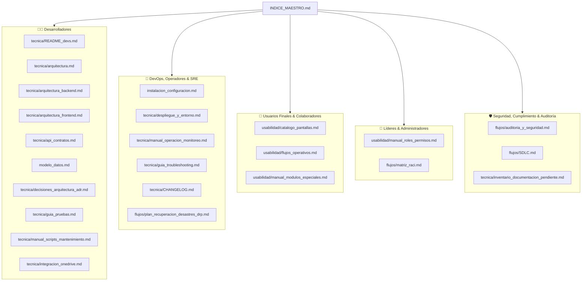

# NOVA WORD — Índice Maestro de Documentación Técnica y Operativa

> **Sistema Operativo Corporativo & Gemelo Digital**  
> **Organizaciones:** Elite Nutrition S.A.S. & Futupro  
> **Versión del Sistema:** 2.0.0 (SemVer)  
> **Estado de la Suite:** Vigente y Auditada  
> **Última Actualización:** Octubre 2026

---

## 1. Propósito de este Índice Maestro

Este documento constituye el **punto de entrada único y centralizado** a toda la base de conocimiento técnico, arquitectónico, operativo y de usabilidad de **NOVA WORD**. 

La suite ha sido construida bajo el principio de **Cero Alucinaciones (Ground Truth)**, verificada contra el código fuente real del frontend (Vue 3 / Vite), backend (FastAPI / Python), esquemas de base de datos relacional y vectorial (PostgreSQL / Supabase / pgvector), middlewares de seguridad, pruebas unitarias y configuraciones de despliegue en Vercel y Render.

---

## 2. Mapa de Documentación Clasificado por Audiencias

Para optimizar la consulta según el perfil del lector, la documentación se divide en cinco dominios de responsabilidad:

---

## 3. Directorio Completo de Entregables

### 3.1. Núcleo y Configuración Base

| Documento | Audiencia Primaria | Propósito y Contenido Clave |
| :--- | :--- | :--- |
| [instalacion_configuracion.md](./instalacion_configuracion.md) | DevOps / Desarrolladores | Prerrequisitos de runtime, dependencias npm/pip, catálogo completo de variables de entorno `.env` y arranque en local. |
| [modelo_datos.md](./modelo_datos.md) | Desarrolladores / DBAs | Diagrama ERD Mermaid completo, definición de las 18+ tablas, claves primarias, foráneas, índices vectoriales `pgvector`, constraints y enums. |

---

### 3.2. Gobernanza y Flujos Transversales (`docs/flujos/`)

| Documento | Audiencia Primaria | Propósito y Contenido Clave |
| :--- | :--- | :--- |
| [flujos/SDLC.md](./flujos/SDLC.md) | Desarrolladores / QA | Ciclo de vida del software, estrategia de ramificación Git (GitFlow adaptado), gates de calidad y revisiones obligatorias. |
| [flujos/auditoria_y_seguridad.md](./flujos/auditoria_y_seguridad.md) | Seguridad / Auditores | Modelo de seguridad por capas, Row Level Security (RLS), autenticación JWT, Content Security Policy (CSP), biometría y trazabilidad. |
| [flujos/matriz_raci.md](./flujos/matriz_raci.md) | Gerencia / Operaciones | Asignación de responsabilidades RACI (Responsable, Aprobador, Consultado, Informado) para cada proceso del sistema. |
| [flujos/plan_recuperacion_desastres_drp.md](./flujos/plan_recuperacion_desastres_drp.md) | Operaciones / SRE / Bodega | Plan de Continuidad (BCP) y Recuperación ante Desastres (DRP): contingencia manual con planillas en bodegas y restauración de base de datos. |

---

### 3.3. Suite Técnica de Ingeniería (`docs/tecnica/`)

| Documento | Audiencia Primaria | Propósito y Contenido Clave |
| :--- | :--- | :--- |
| [tecnica/README_devs.md](./tecnica/README_devs.md) | Desarrolladores | Guía de onboarding rápido, estructura del workspace, convenciones de codificación, linting y comandos esenciales. |
| [tecnica/api_contratos.md](./tecnica/api_contratos.md) | Desarrolladores / Integradores | Especificación REST completa con contratos de petición/respuesta, headers, códigos HTTP, rate limits y esquemas Pydantic. |
| [tecnica/arquitectura.md](./tecnica/arquitectura.md) | Arquitectos / Desarrolladores | Visión macroscópica C4 (Contexto, Contenedores, Componentes), comunicación frontend-backend-BaaS e integraciones con IA. |
| [tecnica/arquitectura_backend.md](./tecnica/arquitectura_backend.md) | Desarrolladores Backend | Estructura interna de FastAPI, middlewares (ProxyHeaders, CORS, SlowAPI), inyección de dependencias JWT y motores de IA. |
| [tecnica/arquitectura_frontend.md](./tecnica/arquitectura_frontend.md) | Desarrolladores Frontend | Arquitectura Vue 3 Composition API, router guards con RBAC, clientes Axios/Supabase Realtime y gestión del estado reactivo. |
| [tecnica/decisiones_arquitectura_adr.md](./tecnica/decisiones_arquitectura_adr.md) | Arquitectos / Auditores | Registro histórico de ADRs (Architecture Decision Records) justificando elecciones de stack, seguridad y modelos de datos. |
| [tecnica/despliegue_y_entorno.md](./tecnica/despliegue_y_entorno.md) | DevOps / SRE | Arquitectura de despliegue en Vercel (Frontend SPA) y Render (Backend FastAPI Gunicorn), configuración DNS y variables CI/CD. |
| [tecnica/guia_pruebas.md](./tecnica/guia_pruebas.md) | QA / Desarrolladores | Estrategia de pruebas unitarias y de integración (Vitest + Vue Test Utils en frontend; Pytest + TestClient en backend). |
| [tecnica/manual_operacion_monitoreo.md](./tecnica/manual_operacion_monitoreo.md) | Operadores / DevOps / SRE | Procedimientos de operación diaria, endpoints de salud, gestión de conexiones BD, respaldos de Supabase y rollbacks. |
| [tecnica/manual_scripts_mantenimiento.md](./tecnica/manual_scripts_mantenimiento.md) | SysAdmins / Backend | Manual operativo de los 14 scripts en `scripts/` (creación de admins, siembra de datos, detección de roles duplicados, ingesta IA). |
| [tecnica/integracion_onedrive.md](./tecnica/integracion_onedrive.md) | Arquitectos / Desarrolladores | Guía de integración con Microsoft OneDrive y SharePoint para manuales de cargo y futura conexión vía Microsoft Graph API. |
| [tecnica/guia_troubleshooting.md](./tecnica/guia_troubleshooting.md) | Soporte / Desarrolladores | Guía de resolución de problemas con árboles de decisión para CORS, expiración JWT, errores RLS 403, 429 Rate Limit y fallas de compilación. |
| [tecnica/CHANGELOG.md](./tecnica/CHANGELOG.md) | Toda la organización | Registro cronológico formal de cambios bajo el estándar Keep a Changelog y versionamiento semántico SemVer. |
| [tecnica/inventario_documentacion_pendiente.md](./tecnica/inventario_documentacion_pendiente.md) | Auditoría / Gestión Técnica | Cláusula de honestidad: listado de elementos marcados como `pendiente de verificación`, soporte de videos en desarrollo y deuda técnica controlada. |

---

### 3.4. Usabilidad, Producto y Operación (`docs/usabilidad/`)

| Documento | Audiencia Primaria | Propósito y Contenido Clave |
| :--- | :--- | :--- |
| [usabilidad/catalogo_pantallas.md](./usabilidad/catalogo_pantallas.md) | Usuarios / Capacitación | Catálogo minucioso de las 18 vistas y modales, inventario de botones, campos de entrada, estados de carga y retroalimentación visual. |
| [usabilidad/flujos_operativos.md](./usabilidad/flujos_operativos.md) | Colaboradores / Líderes | Procedimientos operativos paso a paso: ingreso diario, ejecución y soporte de tareas con foto, reporte diario, órdenes programadas y KPIs. |
| [usabilidad/manual_roles_permisos.md](./usabilidad/manual_roles_permisos.md) | RRHH / Administradores | Manual funcional de accesos: Nivel 1 (Gerencial/Ejecutivo), Nivel 2 (Área/Líder), Nivel 3 (Individual), Master Admin y delegación de claves. |
| [usabilidad/manual_modulos_especiales.md](./usabilidad/manual_modulos_especiales.md) | Usuarios / Comunicación / SST | Manual de módulos especiales: comunicados corporativos y noticias, soporte de videos y capacitación audiovisual por cargo, calendario y mesa de ayuda WhatsApp. |

---

## 4. Convenciones de Navegación y Lectura

1. **Hipervínculos Relativos:** Todos los documentos enlazan entre sí mediante rutas relativas válidas.
2. **Alertas Estandarizadas:**
   - `> [!NOTE]` Información contextual relevante.
   - `> [!IMPORTANT]` Requerimientos mandatorios de diseño o seguridad.
   - `> [!WARNING]` Riesgos operacionales o dependencias críticas.
   - `> [!CAUTION]` Procedimientos de alto impacto en datos o infraestructura.
3. **Cláusula de Honestidad en la Suite:** Cualquier parámetro técnico no verificable en el código fuente actual figura explícitamente etiquetado como `pendiente de verificación` para preservar la fiabilidad absoluta de la información.
