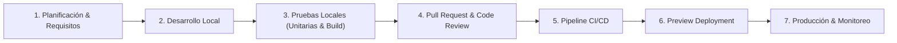
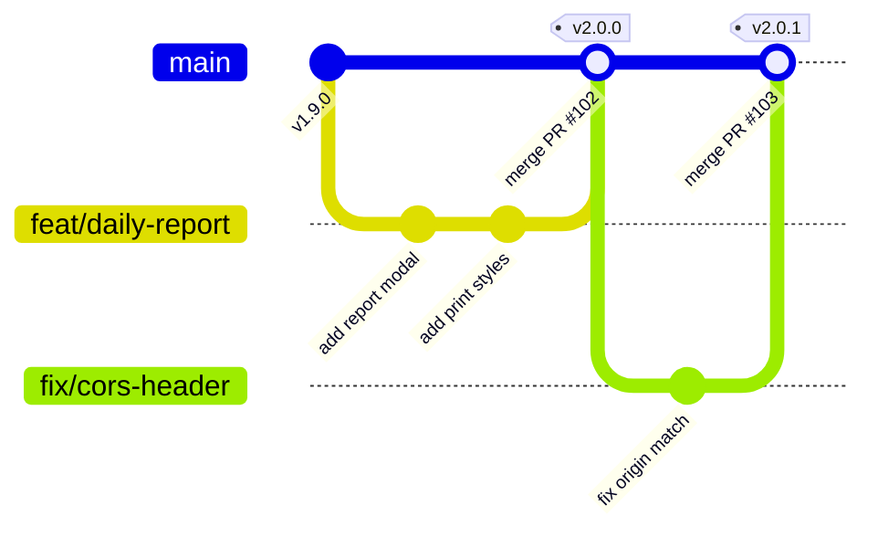

# Ciclo de Vida del Desarrollo de Software (SDLC)

> **Módulo:** Gobernanza y Calidad de Código  
> **Audiencia:** Desarrolladores, Líderes Técnicos, QA, DevOps  
> **Relacionado con:** [INDICE_MAESTRO.md](../INDICE_MAESTRO.md) | [tecnica/guia_pruebas.md](../tecnica/guia_pruebas.md) | [tecnica/despliegue_y_entorno.md](../tecnica/despliegue_y_entorno.md)

---

## 1. Visión General del Proceso SDLC

El desarrollo y mantenimiento de **NOVA WORD** se rige por un ciclo de vida ágil, iterativo y centrado en la calidad y la trazabilidad. Todo cambio introducido al sistema debe superar gates de verificación automatizados y revisiones de código antes de alcanzar el entorno de producción.



---

## 2. Estrategia de Ramificación Git (Git Branching Model)

El repositorio utiliza una variante optimizada de **Trunk-Based Development** asistido por ramas de características (*Feature Branches*):



### 2.1. Nombres y Tipología de Ramas

| Tipo de Rama | Prefijo | Convención de Nombre | Ejemplo |
| :--- | :--- | :--- | :--- |
| **Producción / Tronco** | `main` | Protegida. Solo recibe cambios vía Pull Request aprobado o tags de versión. | `main` |
| **Nueva Característica** | `feat/` | `feat/<modulo>-<descripcion-corta>` | `feat/team-calendar-view` |
| **Corrección de Defecto** | `fix/` | `fix/<modulo>-<descripcion-corta>` | `fix/jwt-expiration-check` |
| **Refactorización** | `refactor/` | `refactor/<modulo>-<descripcion-corta>` | `refactor/task-periods-utility` |
| **Documentación** | `docs/` | `docs/<descripcion-corta>` | `docs/architecture-suite` |
| **Hotfix Urgente** | `hotfix/` | `hotfix/<incidente>` | `hotfix/patch-supabase-key` |

---

## 3. Gates de Calidad Obligatorios (Quality Gates)

Ningún cambio puede fusionarse en la rama `main` sin cumplir satisfactoriamente con los siguientes tres umbrales de validación:

### Gate 1: Compilación Libre de Errores (Build Gate)
El proyecto frontend debe compilar limpiamente bajo Vite:
```bash
cd frontend
npm run build
```
- **Criterio de Aceptación:** Código de salida `0` y ausencia de advertencias bloqueantes de imports no resueltos o dependencias cíclicas.

### Gate 2: Validación de Pruebas Automatizadas (Test Gate)
Tanto el frontend como el backend deben ejecutar sus suites de prueba unitaria:
```bash
# Frontend
cd frontend && npm run test

# Backend
cd backend && pytest -v
```
- **Criterio de Aceptación:** 100% de las pruebas existentes deben pasar con éxito (`PASSED`).

### Gate 3: Verificación de Dependencias y Seguridad (Dependency Gate)
- No deben agregarse paquetes no aprobados al archivo `package.json` o `requirements.txt`.
- No deben commitearse secretos, llaves privadas ni credenciales (`.env`, `.env.local` deben permanecer estrictamente en `.gitignore`).

---

## 4. Convenciones de Commits (Conventional Commits)

Los mensajes de commit deben respetar el estándar semántico internacional:

Formato: `<tipo>(<alcance>): <descripcion en imperativo>`

Ejemplos verificados del proyecto:
- `feat(leader): scope manager team view to direct reports and add calendar view`
- `fix(auth): correct jwt token expiration fallback logic`
- `docs(suite): create technical and operational documentation master index`
- `refactor(kpi): decouple balanced scorecard evaluation engine`

Tipos permitidos: `feat`, `fix`, `docs`, `style`, `refactor`, `perf`, `test`, `chore`, `build`, `ci`.

---

## 5. Procedimiento para Despliegues y Rollbacks

### 5.1. Despliegue Automatizado
1. **Frontend en Vercel:** Cada `git push` a `origin/main` desencadena automáticamente una compilación de producción en la plataforma Vercel. Si el build tiene éxito, el deployment pasa a ser live de inmediato.
2. **Backend en Render:** Cada cambio en la carpeta `backend/` activa la orden de build especificada en `render.yaml` (`pip install -r requirements.txt`) y levanta el servicio con Gunicorn.

### 5.2. Procedimiento de Rollback Inmediato
En caso de un incidente crítico en producción:
1. **Rollback en Vercel:** Desde el dashboard de Vercel (o CLI `vercel rollback`), activar la versión previa verificada (tiempo de restauración: `< 30 segundos`).
2. **Rollback en Git:**
   ```bash
   git revert <commit-hash-con-falla> -m 1
   git push origin main
   ```
3. **Rollback en Base de Datos:** Si la falla involucró una migración destructiva, ejecutar el script de remediación específico ubicado en `database/` o restaurar el Point-in-Time Backup (PITR) desde la consola de Supabase.
