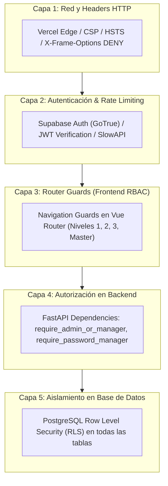
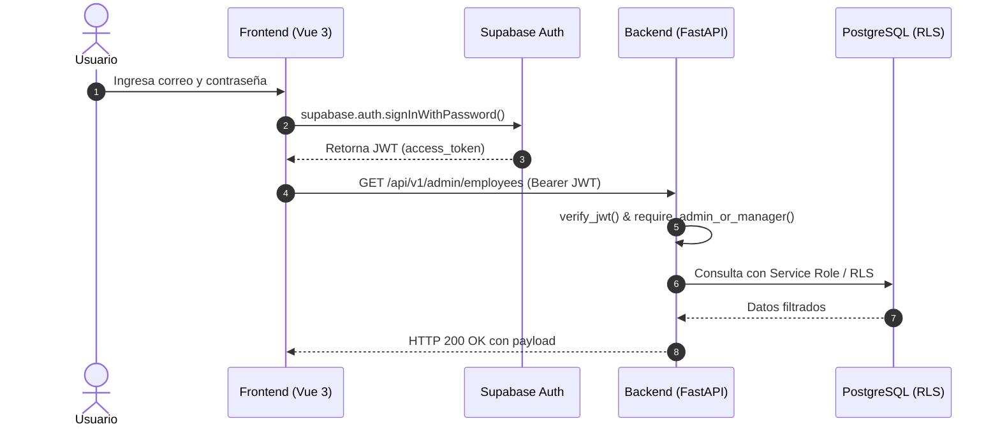
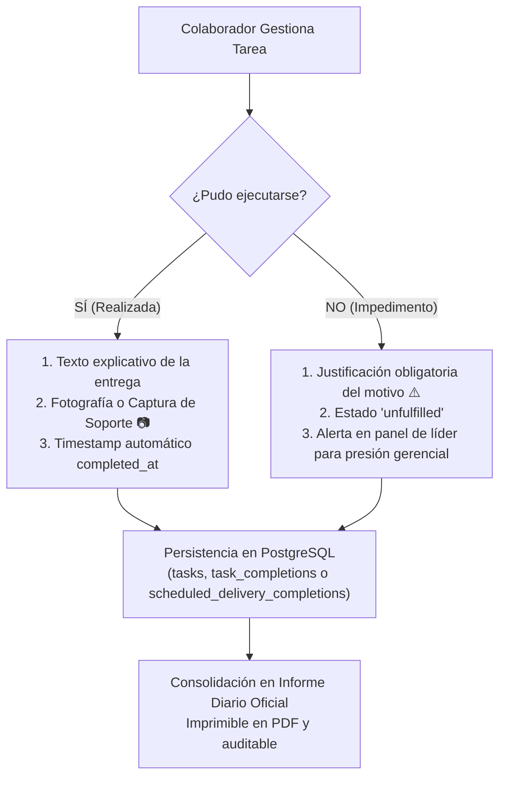

# Flujos de Auditoría, Seguridad y Trazabilidad Inmutable

> **Módulo:** Seguridad y Cumplimiento  
> **Audiencia:** Auditores, Ingenieros de Ciberseguridad, Administradores, Desarrolladores  
> **Relacionado con:** [INDICE_MAESTRO.md](../INDICE_MAESTRO.md) | [tecnica/api_contratos.md](../tecnica/api_contratos.md) | [modelo_datos.md](../modelo_datos.md)

---

## 1. Filosofía de Seguridad: Defensa en Profundidad (Defense in Depth)

La seguridad y la trazabilidad de **NOVA WORD** no dependen de un solo punto de control. Se implementa una estrategia de **Defensa en Profundidad** estructurada en cinco capas independientes:

---

## 2. Capa 1: Seguridad de Red y Cabeceras HTTP

El archivo de configuración de borde `frontend/vercel.json` inyecta obligatoriamente las siguientes directivas de seguridad en todas las respuestas HTTP emitidas por la plataforma:

| Cabecera HTTP | Valor Configurado | Mitigación de Vulnerabilidad |
| :--- | :--- | :--- |
| **Content-Security-Policy** | `default-src 'self'; script-src 'self' 'unsafe-inline' 'unsafe-eval' https://*.supabase.co; connect-src 'self' https://*.supabase.co wss://*.supabase.co https://api.anthropic.com https://*.onrender.com; img-src 'self' data: https:; style-src 'self' 'unsafe-inline' https://fonts.googleapis.com; font-src 'self' https://fonts.gstatic.com;` | Previene inyecciones XSS y restringe conexiones salientes únicamente a endpoints verificados (Supabase, Anthropic, Render). |
| **X-Frame-Options** | `DENY` | Evita ataques de Clickjacking impidiendo que la aplicación sea embebida en un `<iframe>`. |
| **X-Content-Type-Options** | `nosniff` | Impide que el navegador intente deducir (MIME-sniffing) el tipo de contenido fuera del declarado. |
| **Referrer-Policy** | `strict-origin-when-cross-origin` | Limita la fuga de URLs en transiciones de navegación entre orígenes. |
| **Strict-Transport-Security** | `max-age=31536000; includeSubDomains; preload` | Fuerza el uso estricto de cifrado HTTPS durante 1 año en todo el dominio y subdominios. |

---

## 3. Capa 2: Autenticación, JWT y Control de Tasa (Rate Limiting)

### 3.1. Flujo de Autenticación y Verificación de Tokens
1. El usuario introduce credenciales corporativas en `LoginView.vue`.
2. Supabase GoTrue valida el hash de contraseña (bcrypt/Argon2) y retorna un par de tokens:
   - `access_token`: JWT con tiempo de vida corto.
   - `refresh_token`: Token persistente para rotación de sesión.
3. El frontend adjunta el JWT en la cabecera `Authorization: Bearer <access_token>` en todas las solicitudes dirigidas a la API de FastAPI.
4. En el backend, la dependencia `verify_jwt` (`main.py`, líneas 70-130) realiza:
   - Verificación de la firma contra el servidor Supabase (`supabase.auth.get_user(token)`).
   - Fallback offline local decodificando con `SUPABASE_JWT_SECRET` y validando estrictamente el claim de expiración (`exp < time.time()`). Si el token está vencido, rechaza inmediatamente con `HTTP 401 Unauthorized`.
   - Extracción del identificador único del usuario (`sub`) y resolución de identidad.

### 3.2. Rate Limiting con SlowAPI
Para neutralizar ataques de denegación de servicio (DoS) o intentos de fuerza bruta sobre endpoints sensibles, `backend/main.py` incorpora `SlowAPI` limitando peticiones basadas en la IP remota (`get_remote_address`):
- Los endpoints de autenticación, evaluación y chat de IA aplican cuotas dinámicas. Si un cliente sobrepasa el límite, el middleware responde automáticamente con `HTTP 429 Too Many Requests`.

---

## 4. Capa 3 y 4: Control de Acceso Basado en Roles (RBAC)

El sistema opera con una jerarquía de cuatro niveles de autoridad:

| Nivel de Acceso | Denominación en el Sistema | Capacidades y Alcance Operativo |
| :--- | :--- | :--- |
| **Nivel 1** | Gerencia Ejecutiva (`access_level = 1`) | Control total de su área, aprobación de entregas, informe diario, presión masiva, evaluación de KPIs del cargo y asignación táctica. |
| **Nivel 2** | Líder de Área / Coordinador (`access_level = 2`) | Supervisión táctica del equipo, auditoría de tareas, consulta de catálogo y soporte operativo. |
| **Nivel 3** | Colaborador Individual (`access_level = 3`) | Portal del empleado (`/workspace`), checklist de gestión diaria, entregas programadas, registro de fotos de evidencia y chat de IA. |
| **Master Admin** | Administrador Maestro (`is_master_admin = TRUE`) | Acceso global irrestricto, configuración de áreas, catálogo de 70 roles, reestructuración de permisos, aprobación de cuentas y auditoría de todo el holding. |

### 4.1. Delegación Segura de Contraseñas
Para mitigar la sobrecarga de soporte técnico de TI, el sistema permite otorgar el flag `can_manage_passwords = TRUE` a roles autorizados (ej. Gestor de Talento Humano o Gerente de Área). La función `require_password_manager` en el backend verifica que el solicitante sea Master Admin o posea este permiso explícito antes de permitir el restablecimiento de contraseñas de colaboradores.

---

## 5. Capa 5: Aislamiento en Base de Datos (Row Level Security - RLS)

Todas las tablas de **NOVA WORD** tienen activada la directiva `ALTER TABLE ... ENABLE ROW LEVEL SECURITY;`. Ningún usuario del frontend puede consultar o mutar filas que no correspondan a su contexto de permisos, incluso si manipula peticiones desde la consola del navegador:

1. **`tasks`:** Los colaboradores estándar solo pueden consultar filas donde `assigned_to = auth.uid()`. Los líderes pueden consultar las tareas de su equipo según el `area_id` de su rol.
2. **`task_completions`:** Solo el usuario autenticado puede insertar o actualizar sus propios registros (`profile_id = auth.uid()`).
3. **`scheduled_delivery_completions`:** Protegido con `CHECK (profile_id = auth.uid())`.
4. **`role_workflows`:** Solo usuarios autenticados con permisos ejecutivos pueden modificar flujos de trabajo; los colaboradores tienen acceso de solo lectura para consulta operativa.

---

## 6. Trazabilidad Inmutable y Cadena de Evidencias

Para garantizar el principio de rendición de cuentas (*accountability*), la plataforma eliminó el marcado simple de tareas mediante checkbox. Toda acción operativa deja una estela auditable:

### 6.1. Integridad de las Fotografías de Evidencia
Las fotos se cargan directamente desde la cámara o el explorador de archivos del colaborador y se persisten en el bucket de Storage `task_evidence` o en formato Base64 validado con Data URI. Los líderes pueden inspeccionarlas en tamaño completo mediante un visor con zoom (*lightbox*), garantizando que las tareas declaradas como terminadas posean respaldo verificable.
