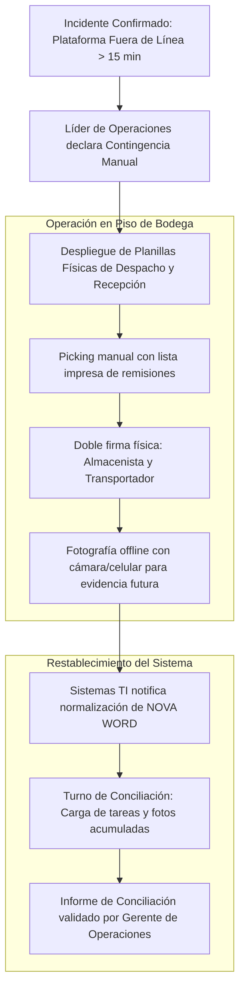
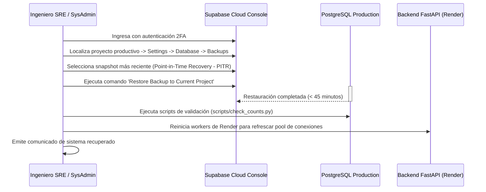

# Plan de Continuidad del Negocio y Recuperación ante Desastres (DRP / BCP)

> **NOVA WORD — Disaster Recovery & Business Continuity Plan**  
> **Clasificación del Documento:** Confidencial Operativo | **Nivel de Criticidad:** Alta  
> **Empresas:** Elite Nutrition S.A.S. & Futupro Colombia  
> **Objetivos Operativos:** RPO < 24 Horas | RTO < 2 Horas (`pendiente de verificación contractual`)

---

## 1. Clasificación de Escenarios de Desastre

| Nivel de Falla | Escenario | Impacto en la Operación | Estrategia de Mitigación |
| :---: | :--- | :--- | :--- |
| **Nivel 1 (Bajo)** | Caída temporal de Vercel (Frontend CDN) | Usuarios no pueden cargar la SPA desde el navegador. | Conmutar DNS hacia réplica en Netlify o servir frontend localmente desde Render (`pendiente de verificación`). |
| **Nivel 2 (Medio)** | Caída del Backend en Render (FastAPI) | Fallan llamadas a IA, creación de empleados y carga de fotos. | El frontend sigue operando contra Supabase directamente para consulta de tareas y organigrama. |
| **Nivel 3 (Alto)** | Indisponibilidad de Supabase Cloud | Caída total de base de datos, autenticación y storage. | **Activar Plan de Contingencia Manual de Bodega**. |
| **Nivel 4 (Catastrófico)** | Corrupción o destrucción de base de datos | Pérdida de registros operacionales recientes. | Restauración desde snapshot diario y re-ejecución de scripts DDL. |

---

## 2. Plan de Contingencia Manual en Bodegas (Operación Sin Sistema)

Si ocurre una caída prolongada de conectividad o falla total de Supabase, las operaciones físicas de despacho en **Elite Nutrition** y **Futupro** no deben detenerse:

### Protocolo de Contingencia Física:
1. **Declaración:** Si el sistema permanece inaccesible por más de 15 minutos en horario pico de despacho, el Coordinador de Bodega autoriza el uso de las **Planillas Físicas de Despacho de Emergencia**.
2. **Registro Manual:** Cada alistamiento se asienta con fecha, hora, código SKU, lote físico y firma del operario.
3. **Registro Fotográfico Local:** El operario toma la fotografía de soporte con el dispositivo móvil corporativo, guardándola en la galería local sin requerir conexión.
4. **Fase de Conciliación Post-Recuperación:**
   - Una vez restablecida la plataforma, el personal dispone de una ventana de **3 horas** para ingresar al sistema, marcar las tareas retroactivamente y adjuntar las fotografías tomadas durante la contingencia.

---

## 3. Procedimiento de Restauración Técnica de Base de Datos (DRP)

### 3.1 Lista de Verificación Post-Restauración (Checklist)
- [ ] Verificar que la tabla `profiles` contenga el total esperado de empleados activos.
- [ ] Validar que la tabla `roles` no presente duplicados ejecutando `python scripts/verificar_roles_duplicados.py`.
- [ ] Probar el inicio de sesión de un usuario de prueba en `/login`.
- [ ] Confirmar que las fotos de perfil y evidencias sigan resolviendo en Supabase Storage.
- [ ] Ejecutar `actualizacion_despliegue.py` para certificar latencias y disponibilidad.

---

## 4. Matriz de Roles y Notificaciones en Emergencia

| Rol en Emergencia | Responsable Primario | Canal de Contacto | Responsabilidad Inmediata |
| :--- | :--- | :--- | :--- |
| **Comandante del Incidente** | Gerente General / Master Admin | Llamada Telefónica Directa | Declara inicio y fin formal del incidente. |
| **Líder Técnico de Recuperación** | Arquitecto de Software / DevOps | Canal Discord / WhatsApp TI | Ejecuta la restauración de servidores y bases de datos. |
| **Líder de Operación en Bodega** | Gerente de Operaciones | WhatsApp Bodega | Distribuye planillas físicas y supervisa despachos manuales. |
| **Oficial de Comunicación** | Talento Humano | Comunicados de Emergencia | Informa a las áreas administrativas el estado del incidente. |

---

*Documento enlazado a [INDICE_MAESTRO.md](../INDICE_MAESTRO.md), [manual_operacion_monitoreo.md](../tecnica/manual_operacion_monitoreo.md) y [SDLC.md](SDLC.md).*
