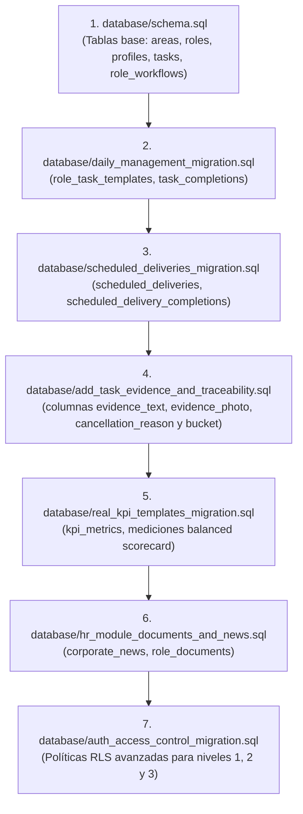

# Guía de Instalación y Configuración del Entorno

> **Módulo:** Plataforma y Entorno  
> **Audiencia:** Desarrolladores, DevOps, Administradores de Sistemas  
> **Relacionado con:** [INDICE_MAESTRO.md](./INDICE_MAESTRO.md) | [tecnica/despliegue_y_entorno.md](./tecnica/despliegue_y_entorno.md) | [tecnica/guia_troubleshooting.md](./tecnica/guia_troubleshooting.md)

---

## 1. Prerrequisitos de Software y Hardware

Antes de clonar e inicializar **NOVA WORD**, asegúrese de contar con las siguientes herramientas instaladas en su estación de trabajo:

| Herramienta | Versión Requerida | Propósito en el Stack | Verificación en CLI |
| :--- | :--- | :--- | :--- |
| **Node.js** | `>= 20.x` (LTS recomendado) | Runtime para tooling de compilación y servidor Vite del Frontend | `node -v` |
| **npm** | `>= 10.x` | Gestor de dependencias del Frontend | `npm -v` |
| **Python** | `3.11.x` | Runtime de ejecución del Backend FastAPI | `python3 --version` |
| **Git** | `>= 2.38` | Control de versiones distribuido | `git --version` |
| **Supabase CLI** | `>= 1.150` *(Opcional)* | Gestión local de contenedores de base de datos PostgreSQL | `supabase --version` |
| **Navegador Web** | Chrome, Edge o Firefox moderno | Compatibilidad con WebGL / Three.js / Canvas para vistas gráficas | Versión reciente |

---

## 2. Clonación y Estructura del Repositorio

Clone el repositorio oficial de GitHub en su máquina local:

```bash
git clone https://github.com/developerelitenova-cell/nova-word-.git
cd nova-word-
```

La raíz del repositorio contiene dos componentes principales:
- `frontend/`: Aplicación Single Page Application (SPA) en Vue 3 con Vite.
- `backend/`: API REST en Python con FastAPI y orquestación de IA.
- `database/`: Scripts DDL de inicialización y migraciones incrementales para Supabase.

---

## 3. Configuración y Despliegue del Backend (FastAPI)

### 3.1. Creación del Entorno Virtual e Instalación de Dependencias

```bash
cd backend

# 1. Crear entorno virtual aislado
python3 -m venv .venv

# 2. Activar el entorno virtual
# En macOS / Linux:
source .venv/bin/activate
# En Windows (PowerShell):
# .venv\Scripts\Activate.ps1

# 3. Actualizar pip e instalar dependencias principales y de prueba
pip install --upgrade pip
pip install -r requirements.txt
pip install -r requirements-test.txt
```

### 3.2. Catálogo de Variables de Entorno del Backend

El backend carga sus variables de entorno mediante `python-dotenv`. Por diseño (`main.py`, línea 25), busca automáticamente las variables en `../frontend/.env.local` o en un archivo `.env` dentro de `backend/`:

| Variable de Entorno | Tipo / Formato | Obligatoria | Descripción y Uso |
| :--- | :--- | :--- | :--- |
| `SUPABASE_URL` | URL `https://*.supabase.co` | **SÍ** | Endpoint REST del proyecto Supabase. Fallback: `VITE_SUPABASE_URL`. |
| `SUPABASE_SERVICE_ROLE_KEY` | JWT Secret Key | **SÍ** | Clave Service Role con privilegios administrativos (omite RLS) para tareas de creación de usuarios y consultas del sistema. |
| `SUPABASE_JWT_SECRET` | String secreto | **Recomendada** | Secreto para decodificar y validar firmas JWT emitidas por Supabase GoTrue cuando se trabaja offline. |
| `ANTHROPIC_API_KEY` | String `sk-ant-*` | **SÍ** | Clave API de Anthropic para los motores de IA (Orquestador, Evaluador de KPIs y Generador de Workflows). |
| `ANTHROPIC_MODEL` | String | No (Default: `claude-sonnet-5`) | Identificador del modelo de lenguaje a utilizar para inferencia cognitiva. |
| `VOYAGE_API_KEY` | String | Condicional | Clave para modelos de vectorización de Voyage AI (si se utiliza en lugar de embeddings nativos). |
| `ALLOWED_ORIGINS` | Lista separada por comas | **SÍ** | Orígenes autorizados en CORS (ej. `http://localhost:5173,https://nova-word.vercel.app`). |
| `PORT` | Entero (Default: `5001`) | No | Puerto TCP en el que el servidor HTTP escuchará conexiones entrantes. |

Ejemplo de configuración para desarrollo local (`backend/.env`):

```ini
# Backend Local Configuration
SUPABASE_URL=https://xyzcompany.supabase.co
SUPABASE_SERVICE_ROLE_KEY=eyJhbGciOiJIUzI1NiIsInR5cCI6IkpXVCJ9...
SUPABASE_JWT_SECRET=super-secret-jwt-key
ALLOWED_ORIGINS=http://localhost:5173,http://127.0.0.1:5173
ANTHROPIC_API_KEY=sk-ant-api03-...
ANTHROPIC_MODEL=claude-sonnet-5
PORT=5001
```

### 3.3. Ejecución del Servidor Backend

Para entorno de desarrollo con recarga automática:
```bash
uvicorn main:app --reload --port 5001 --host 0.0.0.0
```

Para entorno de producción emulado (Gunicorn con 4 workers Uvicorn):
```bash
gunicorn main:app -w 4 -k uvicorn.workers.UvicornWorker --bind 0.0.0.0:5001
```

Verificación en terminal:
```bash
curl http://localhost:5001/
# Respuesta esperada: {"status":"running","service":"Digital Twin Engine - Elite Nutrition","version":"2.0"}
```

---

## 4. Configuración y Despliegue del Frontend (Vue 3 / Vite)

### 4.1. Instalación de Dependencias

Abra una nueva terminal y navegue al directorio del frontend:

```bash
cd frontend
npm install
```

### 4.2. Catálogo de Variables de Entorno del Frontend

Cree el archivo `frontend/.env.local` basándose en el siguiente catálogo de parámetros:

| Variable de Entorno | Tipo | Obligatoria | Propósito |
| :--- | :--- | :--- | :--- |
| `VITE_SUPABASE_URL` | URL | **SÍ** | URL del proyecto Supabase accesible desde el cliente web. |
| `VITE_SUPABASE_ANON_KEY` | JWT Public Key | **SÍ** | Clave anónima pública de Supabase sujeta estrictamente a políticas RLS. |
| `VITE_API_BASE_URL` | URL | **SÍ** | Endpoint del Backend FastAPI (en desarrollo: `http://localhost:5001`). |

Ejemplo de archivo `frontend/.env.local`:

```ini
# Frontend Environment Configuration
VITE_SUPABASE_URL=https://xyzcompany.supabase.co
VITE_SUPABASE_ANON_KEY=eyJhbGciOiJIUzI1NiIsInR5cCI6IkpXVCJ9...
VITE_API_BASE_URL=http://localhost:5001
```

### 4.3. Scripts de Ejecución del Frontend

| Comando | Acción |
| :--- | :--- |
| `npm run dev` | Inicia el servidor de desarrollo Vite en `http://localhost:5173` con HMR (Hot Module Replacement). |
| `npm run build` | Compila y optimiza los assets en el directorio `dist/` para producción. |
| `npm run preview` | Previsualiza localmente el bundle compilado de `dist/`. |
| `npm run test` | Ejecuta las pruebas unitarias y de componentes mediante Vitest. |
| `npm run test:coverage` | Genera el informe de cobertura de código mediante `@vitest/coverage-v8`. |

Para arrancar el frontend en desarrollo:
```bash
npm run dev
```

Abra su navegador en `http://localhost:5173`. El router redirigirá automáticamente a `/login` si no detecta una sesión activa en Supabase Auth.

---

## 5. Inicialización de la Base de Datos (Supabase PostgreSQL)

Para que el sistema funcione con todas sus características (gestión diaria, entregas programadas, evidencia fotográfica y memorias vectoriales), deben aplicarse los scripts ubicados en la carpeta `database/` en el **SQL Editor de Supabase** en el siguiente orden secuencial estricto:



### 5.1. Buckets de Supabase Storage Requeridos

Asegúrese de que los siguientes buckets existan en Supabase Storage con visibilidad pública o políticas RLS activas:
1. `profile_photos`: Avatares y fotos de perfil de colaboradores.
2. `task_evidence`: Fotografías y capturas de pantalla de evidencia operativa.
3. `announcements`: Imágenes adjuntas a noticias y comunicados corporativos.

---

## 6. Verificación de Inicialización Exitosa (Checklist)

- [ ] Backend responde `HTTP 200` en `http://localhost:5001/`.
- [ ] Frontend carga la pantalla de Login en `http://localhost:5173/login`.
- [ ] Supabase Auth permite autenticación con correo corporativo y contraseña.
- [ ] La consola de desarrollo del navegador no presenta errores de conexión CORS hacia `http://localhost:5001`.
- [ ] La tabla `profiles` carga los roles y áreas asignadas al usuario tras el inicio de sesión.
