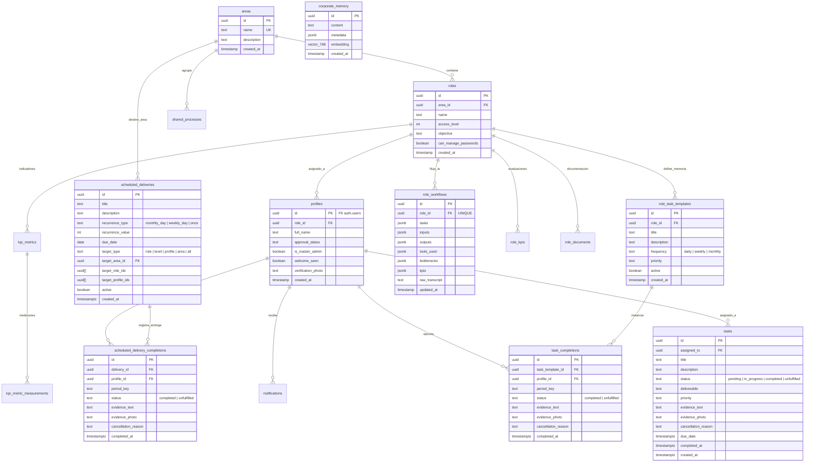

# Modelo de Datos y Esquema Relacional / Vectorial

> **Módulo:** Persistencia y Base de Datos  
> **Audiencia:** Desarrolladores, Arquitectos de Datos, DBAs, Auditores  
> **Relacionado con:** [INDICE_MAESTRO.md](./INDICE_MAESTRO.md) | [flujos/auditoria_y_seguridad.md](./flujos/auditoria_y_seguridad.md) | [tecnica/api_contratos.md](./tecnica/api_contratos.md)

---

## 1. Visión General del Modelo de Datos

**NOVA WORD** utiliza un modelo híbrido relacional y vectorial alojado sobre **PostgreSQL (v15+)** gestionado en **Supabase**. El modelo abarca cuatro dominios funcionales clave:

1. **Estructura Organizacional:** Áreas departamentales, roles jerárquicos y perfiles de colaboradores vinculados a la tabla de identidad (`auth.users`).
2. **Las Tres Capas de Gestión Operativa:**
   - *Capa 1 (Memoria del Cargo / Gestión Recurrente):* `role_task_templates` y sus ejecuciones periódicas en `task_completions`.
   - *Capa 2 (Entregas Programadas):* `scheduled_deliveries` y sus confirmaciones en `scheduled_delivery_completions`.
   - *Capa 3 (Pendientes Asignados Directos):* `tasks` con trazabilidad de evidencias y justificaciones.
3. **Rendimiento, Mediciones y KPIs:** `kpi_metrics`, `kpi_metric_measurements` y el histórico de evaluaciones `role_kpis`.
4. **Inteligencia y Gemelo Digital:** Flujos descubiertos por IA (`role_workflows`), memorias vectoriales para búsqueda semántica (`corporate_memory` con `pgvector`) y alertas automáticas (`system_alerts`).

---

## 2. Diagrama Entidad-Relación (ERD Completo)

---

## 3. Diccionario Detallado de Tablas y Entidades

### 3.1. `areas` (Estructura Organizacional)
Representa las gerencias y áreas funcionales de la compañía (ej. Contabilidad, Comercial, Mercadeo, Operaciones).

| Columna | Tipo de Dato | Nulable | PK / FK | Descripción y Restricciones |
| :--- | :--- | :--- | :--- | :--- |
| `id` | `UUID` | No | **PK** | Identificador único (`uuid_generate_v4()`). |
| `name` | `TEXT` | No | **UNIQUE** | Nombre único del área funcional. |
| `description` | `TEXT` | Sí | - | Resumen del alcance y responsabilidades del área. |
| `created_at` | `TIMESTAMPTZ` | No | - | Fecha de registro en el sistema (Default: `NOW()`). |

---

### 3.2. `roles` (Catálogo de Cargos)
Alberga los 70 cargos oficiales de la organización, delimitando niveles de autoridad y jerarquía.

| Columna | Tipo de Dato | Nulable | PK / FK | Descripción y Restricciones |
| :--- | :--- | :--- | :--- | :--- |
| `id` | `UUID` | No | **PK** | Identificador único del rol. |
| `name` | `TEXT` | No | - | Título formal del cargo (ej. *"Gerente de Contabilidad"*). |
| `area_id` | `UUID` | Sí | **FK** | Referencia a `areas(id)` con `ON DELETE SET NULL`. |
| `access_level` | `INTEGER` | No | - | Nivel de jerarquía: `1` (Ejecutivo / Gerencia), `2` (Líder de Área), `3` (Individual / Operativo). |
| `objective` | `TEXT` | Sí | - | Misión y propósito estratégico del cargo. |
| `can_manage_passwords` | `BOOLEAN` | No | - | Permiso delegado para gestionar contraseñas del equipo (Default: `FALSE`). |
| `created_at` | `TIMESTAMPTZ` | No | - | Fecha de creación del registro. |

---

### 3.3. `profiles` (Usuarios del Sistema)
Extensión de la tabla de autenticación (`auth.users`) que almacena la información de identidad empresarial y estado de aprobación.

| Columna | Tipo de Dato | Nulable | PK / FK | Descripción y Restricciones |
| :--- | :--- | :--- | :--- | :--- |
| `id` | `UUID` | No | **PK / FK** | Referencia 1 a 1 a `auth.users(id)` con `ON DELETE CASCADE`. |
| `full_name` | `TEXT` | No | - | Nombres y apellidos completos del colaborador. |
| `role_id` | `UUID` | Sí | **FK** | Cargo asignado al colaborador, referencia a `roles(id)`. |
| `is_master_admin` | `BOOLEAN` | No | - | Flag de superusuario con acceso global sin restricciones RLS (Default: `FALSE`). |
| `approval_status` | `TEXT` | No | - | Estado de la cuenta: `'pending'`, `'approved'`, `'rejected'`, `'suspended'` (Default: `'approved'`). |
| `welcome_seen` | `BOOLEAN` | No | - | Indica si el usuario visualizó el onboarding de bienvenida inicial (Default: `FALSE`). |
| `verification_photo` | `TEXT` | Sí | - | Imagen de validación biométrica o foto de perfil en Base64 o URL de Supabase Storage. |
| `created_at` | `TIMESTAMPTZ` | No | - | Fecha de vinculación del colaborador. |

---

### 3.4. `tasks` (Capa 3: Pendientes Asignados Directos)
Tareas puntuales asignadas directamente por líderes o generadas ad-hoc, con soporte de trazabilidad inmutable.

| Columna | Tipo de Dato | Nulable | PK / FK | Descripción y Restricciones |
| :--- | :--- | :--- | :--- | :--- |
| `id` | `UUID` | No | **PK** | Identificador único de la tarea. |
| `title` | `TEXT` | No | - | Nombre explícito de la tarea. |
| `description` | `TEXT` | Sí | - | Instrucciones detalladas de ejecución. |
| `deliverable` | `TEXT` | Sí | - | Entregable específico pactado (ej. *"Excel de conciliación"*). |
| `assigned_to` | `UUID` | Sí | **FK** | Colaborador responsable, referencia a `profiles(id)`. |
| `status` | `TEXT` | No | - | Estado: `'pending'`, `'in_progress'`, `'completed'`, `'unfulfilled'` (Default: `'pending'`). |
| `priority` | `TEXT` | No | - | Prioridad: `'low'`, `'medium'`, `'high'`, `'urgent'` (Default: `'medium'`). |
| `evidence_text` | `TEXT` | Sí | - | Justificación o detalle de la entrega registrada por el colaborador. |
| `evidence_photo` | `TEXT` | Sí | - | Fotografía o captura de pantalla de soporte (Storage URL o Base64). |
| `cancellation_reason` | `TEXT` | Sí | - | Justificación obligatoria cuando la tarea se marca como `'unfulfilled'` (No cumplida). |
| `due_date` | `TIMESTAMPTZ` | Sí | - | Fecha y hora límite de entrega. |
| `started_at` | `TIMESTAMPTZ` | Sí | - | Marca de tiempo en la que el usuario inició la tarea. |
| `completed_at` | `TIMESTAMPTZ` | Sí | - | Marca de tiempo en la que se gestionó y guardó la evidencia. |
| `created_at` | `TIMESTAMPTZ` | No | - | Fecha de creación del pendiente. |

---

### 3.5. `role_task_templates` (Capa 1: Memoria del Cargo)
Plantillas de tareas recurrentes propias del estándar operativo de cada cargo (ej. *"Revisar correos"*, *"Cierre de caja"*).

| Columna | Tipo de Dato | Nulable | PK / FK | Descripción y Restricciones |
| :--- | :--- | :--- | :--- | :--- |
| `id` | `UUID` | No | **PK** | Identificador de la plantilla. |
| `role_id` | `UUID` | No | **FK** | Rol al que pertenece la actividad, referencia a `roles(id)` con `ON DELETE CASCADE`. |
| `title` | `TEXT` | No | - | Nombre de la actividad recurrente. |
| `description` | `TEXT` | Sí | - | Detalle de cómo debe ejecutarse. |
| `frequency` | `TEXT` | No | - | Frecuencia estricta: `'daily'`, `'weekly'`, `'monthly'`. |
| `priority` | `TEXT` | No | - | Nivel de criticidad: `'low'`, `'medium'`, `'high'`. |
| `active` | `BOOLEAN` | No | - | Si la tarea continúa vigente en el catálogo del cargo (Default: `TRUE`). |
| `created_by` | `UUID` | Sí | **FK** | Referencia a `profiles(id)` del líder que creó la plantilla. |
| `created_at` | `TIMESTAMPTZ` | No | - | Fecha de registro. |

---

### 3.6. `task_completions` (Cumplimiento de Memoria del Cargo)
Registro de cumplimiento periódico por colaborador, asociado a un período dinámico (`period_key`).

| Columna | Tipo de Dato | Nulable | PK / FK | Descripción y Restricciones |
| :--- | :--- | :--- | :--- | :--- |
| `id` | `UUID` | No | **PK** | Identificador del registro de cumplimiento. |
| `task_template_id` | `UUID` | No | **FK** | Referencia a `role_task_templates(id)` con `ON DELETE CASCADE`. |
| `profile_id` | `UUID` | No | **FK** | Referencia al colaborador en `profiles(id)` con `ON DELETE CASCADE`. |
| `period_key` | `TEXT` | No | - | Clave de período: `'YYYY-MM-DD'` (diaria), `'YYYY-MM-DD'` del lunes (semanal) o `'YYYY-MM'` (mensual). |
| `status` | `TEXT` | No | - | `'completed'` o `'unfulfilled'` (Default: `'completed'`). |
| `evidence_text` | `TEXT` | Sí | - | Texto de evidencia del colaborador. |
| `evidence_photo` | `TEXT` | Sí | - | Foto de soporte en formato URL o Base64. |
| `cancellation_reason` | `TEXT` | Sí | - | Motivo de no ejecución en caso de ser `'unfulfilled'`. |
| `completed_at` | `TIMESTAMPTZ` | No | - | Fecha y hora en la que se guardó el registro. |

> **Constraint de Unicidad:** `UNIQUE(task_template_id, profile_id, period_key)`. Garantiza que un colaborador solo tenga un estado registrado por cada tarea y período.

---

### 3.7. `scheduled_deliveries` (Capa 2: Entregas Programadas)
Compromisos periódicos que disparan automáticamente en fechas predefinidas para áreas, cargos o colaboradores.

| Columna | Tipo de Dato | Nulable | PK / FK | Descripción |
| :--- | :--- | :--- | :--- | :--- |
| `id` | `UUID` | No | **PK** | Identificador único de la entrega. |
| `title` | `TEXT` | No | - | Título del entregable programado. |
| `description` | `TEXT` | Sí | - | Instrucciones técnicas de la entrega. |
| `recurrence_type` | `TEXT` | No | - | Tipo: `'monthly_day'` (día del mes 1-31), `'weekly_day'` (1=Lunes a 7=Domingo), `'once'` (fecha fija). |
| `recurrence_value` | `INTEGER` | Sí | - | Valor numérico del día (ej. `7` para día 7 del mes; `1` para cada lunes). |
| `due_date` | `DATE` | Sí | - | Fecha obligatoria cuando `recurrence_type = 'once'`. |
| `target_type` | `TEXT` | No | - | Destino: `'role'`, `'level'`, `'profile'`, `'area'`, `'all'`. |
| `target_area_id` | `UUID` | Sí | **FK** | Área de destino si `target_type = 'area'`. |
| `target_role_ids` | `UUID[]` | Sí | - | Lista de UUIDs de roles destinatarios si `target_type = 'role'`. |
| `target_profile_ids` | `UUID[]` | Sí | - | Lista de UUIDs de personas específicas si `target_type = 'profile'`. |
| `active` | `BOOLEAN` | No | - | Si la orden programada está activa (Default: `TRUE`). |

---

### 3.8. `corporate_memory` (RAG y Memoria Vectorial)
Almacenamiento de fragmentos textuales vectorizados para inferencia semántica y gemelo digital corporativo.

| Columna | Tipo de Dato | Nulable | Descripción |
| :--- | :--- | :--- | :--- |
| `id` | `UUID` | No | **PK** generado por `uuid_generate_v4()`. |
| `content` | `TEXT` | No | Texto sin procesar (fragmentos de entrevistas, manuales, políticas). |
| `metadata` | `JSONB` | No | Metadatos de procedencia: `{"source": "role_workflows", "role_id": "...", "category": "bottleneck"}`. |
| `embedding` | `VECTOR(768)` | No | Vector de 768 dimensiones generado por modelos de embeddings. |
| `created_at` | `TIMESTAMPTZ` | No | Fecha de ingesta del conocimiento. |

---

## 4. Índices y Optimización de Consultas

| Tabla | Nombre del Índice | Tipo | Columnas Indexadas | Razón de Rendimiento |
| :--- | :--- | :--- | :--- | :--- |
| `role_task_templates` | `role_task_templates_role_id_idx` | B-Tree | `role_id` | Acelera la carga de la memoria del cargo por rol. |
| `task_completions` | `task_completions_profile_period_idx` | B-Tree | `profile_id, period_key` | Optimiza la consulta diaria/semanal de estados de tareas en el portal del empleado. |
| `corporate_memory` | `corporate_memory_embedding_idx` | IVFFlat / Cosine | `embedding vector_cosine_ops` | Búsqueda aproximada de vecinos más cercanos (ANN) con `lists = 100`. |
| `tasks` | `tasks_assigned_to_idx` | B-Tree | `assigned_to, status` | Filtrado instantáneo de tareas pendientes por colaborador. |

---

## 5. Reglas de Integridad Referencial y Cascada

- **Borrado de Roles (`roles`):** Provoca borrado en cascada (`ON DELETE CASCADE`) de sus `role_task_templates`, `role_workflows`, `kpi_templates` y `role_kpis`. Sin embargo, en `profiles` se previene el borrado accidental manteniendo `ON DELETE RESTRICT` o requiriendo reasignación manual.
- **Borrado de Perfiles (`profiles`):** Está sujeto a la eliminación del usuario en `auth.users(id)` (`ON DELETE CASCADE`). Al eliminarse un perfil, sus tareas completadas (`task_completions`) se purgan en cascada para preservar la consistencia relacional.
