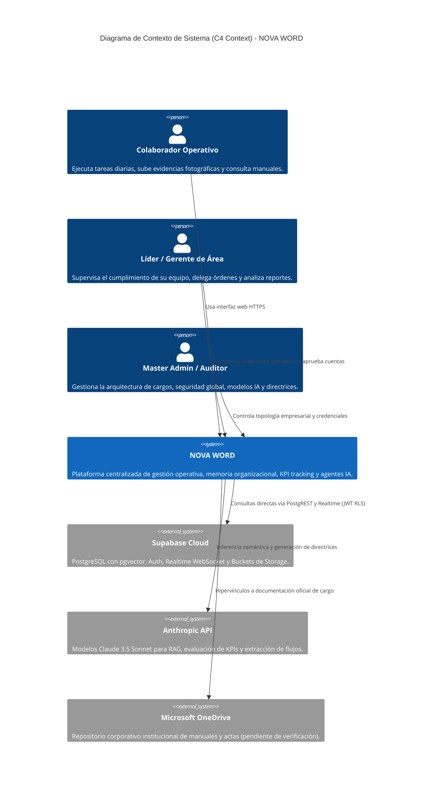
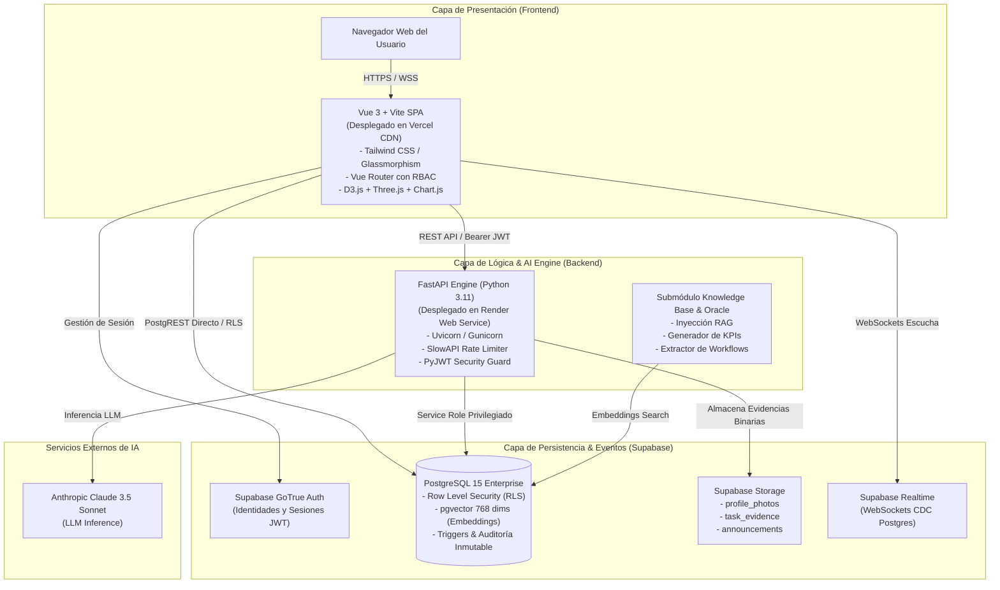
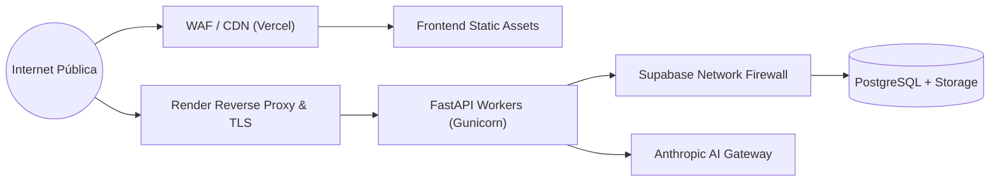

# Arquitectura Global del Sistema

> **NOVA WORD — Enterprise Operating System**  
> **Versión de Arquitectura:** 2.1.0 | **Diseño:** Micro-Servicios Híbridos / Jamstack Cloud-Native  
> **Empresas Soportadas:** Elite Nutrition S.A.S. & Futupro Colombia

---

## 1. Visión y Topología de Alto Nivel

NOVA WORD está diseñado bajo una arquitectura desacoplada y orientada a eventos, combinando una Single Page Application (SPA) reactiva en el frontend, un motor de lógica e inferencia REST en FastAPI, y un backend as a service empresarial montado sobre PostgreSQL administrado (Supabase).

---

## 2. Diagrama de Contenedores (C4 Container)

El sistema distribuye sus responsabilidades operativas en tres capas independientes:

---

## 3. Principios de Arquitectura y Patrones de Diseño

### 3.1 Doble Canal de Comunicación (Dual-Channel Architecture)
1. **Canal Directo Frontend ↔ Supabase (PostgREST & Realtime):**
   - Utilizado para operaciones transaccionales comunes: lectura de tareas, marcado de checklist, consulta de catálogo de cargos y notificaciones en vivo.
   - La seguridad no reside en el servidor web intermedio, sino en el motor PostgreSQL mediante políticas de **Row Level Security (RLS)** que evalúan `auth.uid()`.
2. **Canal Seguro Frontend ↔ FastAPI ↔ Supabase/Anthropic:**
   - Utilizado para operaciones de alta criticidad: creación administrativa de usuarios (`admin/create-employee`), subida y validación estricta de fotos de identidad, cálculo algorítmico de KPIs, inferencia RAG y conversiones vectoriales.
   - FastAPI utiliza la `SUPABASE_SERVICE_ROLE_KEY` tras autenticar y autorizar rigurosamente el JWT del usuario emisor.

### 3.2 Aislamiento Multi-Empresa (Multi-Tenant Segregation)
NOVA WORD soporta la operación conjunta de **Elite Nutrition S.A.S.** y **Futupro Colombia**:
- Cada usuario en `profiles` cuenta con el atributo `company`.
- Las consultas en la interfaz y las políticas RLS aíslan los registros operativos según la empresa del usuario en sesión, impidiendo que líderes o colaboradores accedan a datos financieros o actas de la otra entidad.
- El usuario **Master Admin** posee visibilidad global y puede conmutar entre contextos corporativos.

### 3.3 Integración de Inteligencia Artificial (RAG & Agentes Especialistas)
- **Vector Store:** PostgreSQL con la extensión `vector` habilitada, almacenando tensores de 768 dimensiones generados a partir de los manuales y directrices operativas.
- **Inferencia Contextual:** Cuando un usuario consulta al Agente de su Cargo (`/api/v1/chat`), el backend realiza una búsqueda de similitud de coseno (`1 - (embedding <=> query)`), inyecta los fragmentos pertinentes en el System Prompt de Claude 3.5 Sonnet y genera respuestas alineadas con los manuales corporativos.

---

## 4. Perímetro de Red y Seguridad

- **Cifrado en Tránsito:** Todo el tráfico transita exclusivamente por TLS 1.3 con certificados gestionados automáticamente.
- **Encabezados de Seguridad:** Inyección de `Content-Security-Policy`, `X-Frame-Options: DENY`, `X-Content-Type-Options: nosniff` y `Referrer-Policy: strict-origin-when-cross-origin`.
- **Cero Secretos en el Frontend:** Las variables expuestas al navegador (`VITE_SUPABASE_URL`, `VITE_SUPABASE_ANON_KEY`) solo conceden privilegios públicos protegidos por RLS. Las llaves maestras (`SUPABASE_SERVICE_ROLE_KEY`, `ANTHROPIC_API_KEY`) residen encriptadas en el backend.

---

*Documento enlazado a [INDICE_MAESTRO.md](../INDICE_MAESTRO.md), [arquitectura_backend.md](arquitectura_backend.md) y [arquitectura_frontend.md](arquitectura_frontend.md).*
