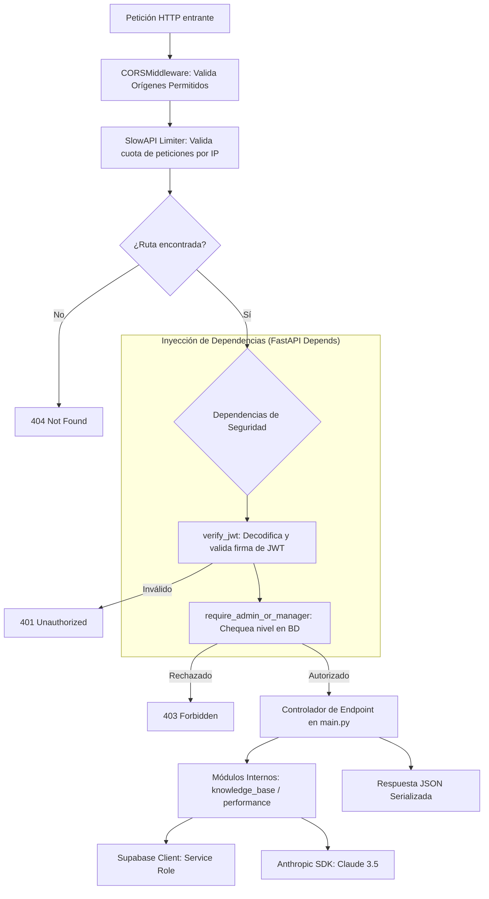

# Arquitectura Interna del Backend

> **NOVA WORD — Core Backend Service**  
> **Directorio:** `backend/` | **Punto de Entrada:** `backend/main.py`  
> **Tecnología:** Python 3.11 / FastAPI 2.0 / Pydantic / Uvicorn / Gunicorn

---

## 1. Organización del Código y Módulos

```text
backend/
├── main.py                     # Instanciación de FastAPI, middlewares, rutas y controladores
├── requirements.txt            # Dependencias de producción
├── requirements-test.txt       # Dependencias del arnés de pruebas (pytest, pytest-asyncio, httpx)
├── pytest.ini                  # Configuración de pruebas automatizadas
├── render.yaml                 # Manifiesto de infraestructura como código (IaC) para Render
├── knowledge_base/             # Módulo de RAG, embeddings y oráculo
│   ├── __init__.py
│   ├── oracle_tools.py         # Utilidades de consulta semántica a PostgreSQL (pgvector)
│   └── role_agents.py          # Definición de prompts de sistema e inferencia Claude
├── performance/                # Módulo de métricas de desempeño y tareas
│   ├── __init__.py
│   ├── task_manager.py         # Lógica de cálculo y asignación de pendientes
│   └── kpi_evaluator.py        # Motor de ponderación cuantitativa de metas
├── simulation_engine/          # Módulo experimental de simulación de flujos
│   └── __init__.py
└── tests/                      # Suite de pruebas automatizadas
    ├── test_auth.py            # Validación de JWT y dependencias de seguridad
    ├── test_employees.py       # Pruebas de endpoints administrativos
    └── test_tasks.py           # Pruebas de ciclo de vida de tareas
```

---

## 2. Flujo de Procesamiento y Middlewares

Toda solicitud entrante al backend atraviesa una tubería estrictamente ordenada de middlewares antes de alcanzar los controladores:



### 2.1 Configuración de CORS
Definida en `backend/main.py`:
- **Orígenes permitidos:** `http://localhost:5173`, `http://127.0.0.1:5173`, `https://*.vercel.app` y los dominios productivos asignados a Elite Nutrition y Futupro.
- **Métodos permitidos:** `GET`, `POST`, `PUT`, `DELETE`, `OPTIONS`.
- **Encabezados permitidos:** `Authorization`, `Content-Type`, `Accept`.
- **Credenciales:** `allow_credentials=True`.

### 2.2 Limitador de Tráfico (SlowAPI)
- Integrado directamente con el estado de la aplicación: `state.limiter = limiter`.
- Controla abusos volumétricos y ataques de denegación de servicio (DoS) a nivel de capa de aplicación, salvaguardando la cuota de la API de Anthropic y de Supabase.

---

## 3. Inyección de Dependencias y Seguridad

El backend implementa el patrón de inyección de dependencias nativo de FastAPI para desacoplar la autenticación y autorización de la lógica de negocio:

### 3.1 `verify_jwt(credentials: HTTPAuthorizationCredentials = Security(security))`
- Extrae el token portador del encabezado `Authorization: Bearer <TOKEN>`.
- **Verificación criptográfica:**
  1. Decodifica el token utilizando `SUPABASE_JWT_SECRET` (algoritmo `HS256`).
  2. Valida la fecha de expiración (`exp`) y emisor (`iss`).
  3. Si la verificación local falla, realiza una validación fallback consultando el endpoint `auth.getUser(token)` de Supabase.
- Retorna el diccionario de claims del usuario autenticado (incluyendo `sub` como UUID del usuario).

### 3.2 `require_admin_or_manager(user = Depends(verify_jwt))`
- Consulta la tabla `profiles` unida con `roles` para el `user_id` autenticado.
- Valida si `is_master_admin == True` o si `roles.access_level` es `1` (Gerente / Nivel 1).
- Si la condición no se cumple, eleva inmediatamente un `HTTPException(status_code=403, detail="Permisos insuficientes para esta operación")`.

### 3.3 `require_password_manager(user = Depends(verify_jwt))`
- Verifica si el usuario actual pertenece a los roles que tienen delegada la facultad de gestionar o resetear contraseñas de subordinados (registrado en `password_delegated_roles`).

---

## 4. Submódulos del Dominio

### 4.1 `knowledge_base` (RAG y Agentes Especialistas)
- **`oracle_tools.py`:** Administra las consultas a PostgreSQL utilizando el operador de distancia `<=>` sobre columnas de tipo `vector(768)`. Convierte la pregunta del usuario en un vector semántico y rescata los 5 fragmentos más afines con un umbral mínimo de similitud de `0.75`.
- **`role_agents.py`:** Ensambla los Prompts de Sistema para cada rol organizacional, inyectando la información recuperada de los manuales y fijando las directrices de tono, autoridad y reglas operativas de Elite Nutrition y Futupro. Invoca el SDK de Anthropic usando el modelo `claude-3-5-sonnet-20241022` (o alias `claude-sonnet-5`).

### 4.2 `performance` (Evaluación y Métricas)
- **`task_manager.py`:** Centraliza las reglas de negocio para la agregación de tareas: cálculo de cumplimiento diario, porcentaje de tareas concluidas a tiempo frente a tareas canceladas con justificación.
- **`kpi_evaluator.py`:** Modela fórmulas matemáticas de indicadores de desempeño (ej. IRA, OTIF, Nivel de Merma) y emite diagnósticos automáticos en base a rangos de semaforización (Verde: >90%, Amarillo: 75%-89%, Rojo: <75%).

### 4.3 `simulation_engine`
- Diseñado para proyectar la carga de trabajo de los cargos a partir del número de órdenes programadas y tareas recurrentes por periodo.

---

## 5. Manejo Centralizado de Excepciones y Logging

- **Logging Estructurado:** El servicio utiliza el módulo `logging` de Python configurado en nivel `INFO` con formato ISO 8601: `%(asctime)s [%(levelname)s] %(name)s: %(message)s`.
- **Captura de Errores Supabase:** Los fallos retornados por el cliente de base de datos se encapsulan en excepciones HTTP estándar evitando exponer volcados de memoria (stack traces) o credenciales al cliente final.

---

*Documento enlazado a [INDICE_MAESTRO.md](../INDICE_MAESTRO.md), [api_contratos.md](api_contratos.md) y [arquitectura.md](arquitectura.md).*
