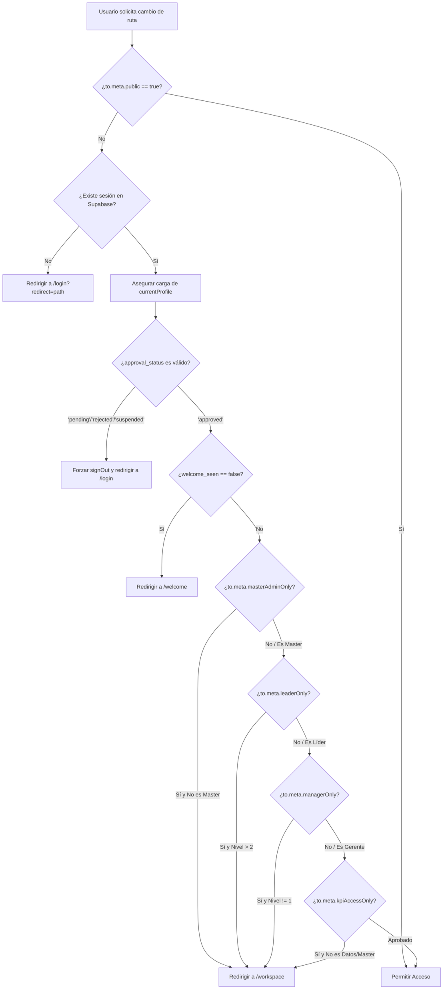
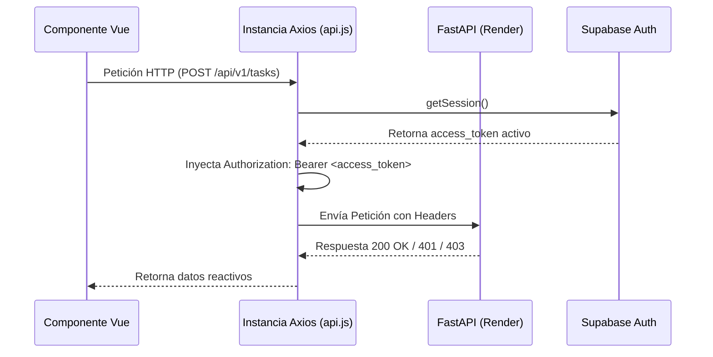

# Arquitectura Interna del Frontend

> **NOVA WORD — Enterprise Frontend SPA**  
> **Directorio:** `frontend/` | **Punto de Entrada:** `src/main.js`  
> **Tecnologías:** Vue 3.5.24 (Composition API `<script setup>`), Vite 7.3.6, Tailwind CSS 3.4.19, Vue Router 4.6.3, Supabase JS Client 2.39.8

---

## 1. Estructura de Directorios del Frontend

```text
frontend/
├── index.html                   # HTML base con fuentes Inter/Outfit y meta tags
├── vite.config.js               # Configuración del empaquetador y alias '@'
├── tailwind.config.js           # Paleta corporativa de colores, sombras y animaciones
├── package.json                 # Declaración de dependencias y scripts de construcción
├── src/
│   ├── main.js                  # Inicialización de la aplicación Vue y plugins
│   ├── App.vue                  # Componente raíz con Navbar global y layout base
│   ├── style.css                # Estilos globales, reseteo CSS y utilidades glassmorphism
│   ├── api/                     # Capa de comunicación de datos
│   │   ├── supabase.js          # Cliente singleton de Supabase
│   │   ├── auth.js              # Estado reactivo del perfil, login, logout y carga de permisos
│   │   └── api.js               # Instancia de Axios con interceptores JWT para FastAPI
│   ├── router/                  # Enrutamiento y control de acceso
│   │   └── index.js             # Definición de rutas y Guards de navegación RBAC
│   ├── components/              # Componentes visuales reutilizables
│   │   ├── Navbar.vue           # Barra de navegación adaptable según rol
│   │   ├── RoleModal.vue        # Modal de detalle y edición de cargo
│   │   ├── EvidenceModal.vue    # Modal emergente para justificación y foto de tareas
│   │   └── ...                  # Modales y widgets especializados
│   └── views/                   # Pantallas principales del sistema (18 vistas)
│       ├── Home.vue             # Landing page corporativa
│       ├── LoginView.vue        # Portal de autenticación y autoregistro
│       ├── EmployeeWorkspace.vue# Espacio de trabajo diario del colaborador
│       ├── LeaderDashboard.vue  # Cuadrante de supervisión gerencial
│       ├── MapaCargos.vue       # Organigrama y mapa de funciones
│       ├── KpiManager.vue       # Gestión de indicadores cuantitativos
│       ├── HRDashboard.vue      # Administración de colaboradores y aprobación
│       └── ...                  # Vistas restantes
```

---

## 2. Gestión del Estado Reactivo (State Management)

La aplicación opta por un patrón de **Reactive Stores ligeros** basados en `ref()` y `computed()` de Vue 3, centralizados en `src/api/auth.js`, prescindiendo de dependencias externas pesadas como Pinia para mantener el bundle ligero y el arranque ultrarrápido:

```javascript
// src/api/auth.js (Extracto conceptual verificado en código)
import { ref } from 'vue'
import { supabase } from './supabase'

export const currentProfile = ref(null)
export const authReady = ref(false)

export async function loadCurrentProfile() {
  const { data: { session } } = await supabase.auth.getSession()
  if (!session) {
    currentProfile.value = null
    authReady.value = true
    return null
  }
  
  const { data, error } = await supabase
    .from('profiles')
    .select('*, roles(*)')
    .eq('id', session.user.id)
    .single()
    
  currentProfile.value = data
  authReady.value = true
  return data
}
```

### Propiedades Reactivas Globales:
- `currentProfile.value`: Contiene el objeto completo del colaborador en sesión, su rol asignado, área, nivel de acceso (`access_level`), estado de aprobación (`approval_status`), empresa (`Elite Nutrition` / `Futupro`) y bandera `is_master_admin`.
- `authReady.value`: Booleano que previene condiciones de carrera en los guards del enrutador antes de resolver la identidad en Supabase.

---

## 3. Sistema de Control de Acceso en Navegación (Router Guards)

Implementado en `src/router/index.js`, intercepta cada cambio de ruta mediante `router.beforeEach`:



### Reglas de Acceso por Metadato de Ruta:
1. `meta.public`: Accesible sin autenticación (`/`, `/login`, `/pending-approval`).
2. `meta.masterAdminOnly`: Exclusivo para usuarios con `is_master_admin === true` (`/mapa-procesos`, `/master`, `/oracle`, `/knowledge-loader`, `/roles`).
3. `meta.leaderOnly`: Accesible para Master Admin o usuarios con rol de Nivel 1 (Gerente) o Nivel 2 (Líder) (`/mapa-cargos`, `/performance`, `/manuals`, `/rrhh`, `/events`, `/support-contacts`).
4. `meta.managerOnly`: Exclusivo para Gerentes de Área con `access_level === 1` o Master Admin (`/leader`).
5. `meta.kpiAccessOnly`: Restringido a Master Admin y colaboradores cuyo cargo contenga `'analista de datos'` o `'especialista de datos'` (`/kpis`).
6. `meta.mapperRoute`: Valida que el colaborador solo pueda diligenciar el cuestionario de mapeo de su propio cargo (`profile.role_id === to.params.role_id`), salvo Master Admin.

---

## 4. Capa de Comunicación e Interceptores



- **Axios Interceptor:** Captura cada solicitud dirigida al backend FastAPI e inyecta dinámicamente el JWT emitido por Supabase Auth, asegurando que las sesiones expiradas sean redirigidas a login sin romper la aplicación.
- **Supabase Realtime Subscriptions:** Se suscriben a canales Postgres CDC (`supabase.channel('public:tasks')`) para refrescar reactivamente la lista de pendientes y la campana de notificaciones sin requerir recargas de página.

---

## 5. Librerías de Visualización y Rendimiento

1. **D3.js (v7.9.0):** Empleado en `MapaCargos.vue` para generar el organigrama interactivo basado en árboles colapsables SVG con zoom y paneo suave.
2. **Three.js (v0.186.0):** Empleado en `ProcessMap` para la visualización tridimensional de grafos de procesos y dependencias interdepartamentales.
3. **Chart.js (v4.5.1):** Generación de gráficas de radar para competencias laborales, líneas de tendencia de KPIs y velocímetros de cumplimiento operativo.
4. **DOMPurify (v3.4.14):** Sanitización estricta de cualquier contenido HTML o Markdown antes de ser renderizado en pantalla (prevención de XSS en manuales y comunicados).

---

## 6. Sistema de Diseño y Paleta Visual

Construido sobre Tailwind CSS con tema oscuro por defecto y estética de centro de control empresarial (Glassmorphism):
- **Fondo Base Primario:** `#08090d` / `#0b0d14`
- **Fondo de Tarjetas (Surface):** `#11131a` con bordes semi-translúcidos `rgba(255, 255, 255, 0.08)`
- **Acento Neón Cyan (Elite Nutrition):** `#00e5ff`
- **Acento Índigo / Púrpura (NOVA WORD Core):** `#6366f1` / `#8b5cf6`
- **Tipografías:** `Inter` (cuerpo y datos numéricos) y `Outfit` (títulos y encabezados de cuadrantes).

---

*Documento enlazado a [INDICE_MAESTRO.md](../INDICE_MAESTRO.md), [arquitectura.md](arquitectura.md) y [catalogo_pantallas.md](../usabilidad/catalogo_pantallas.md).*
