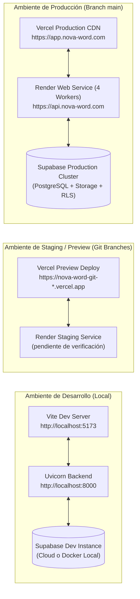
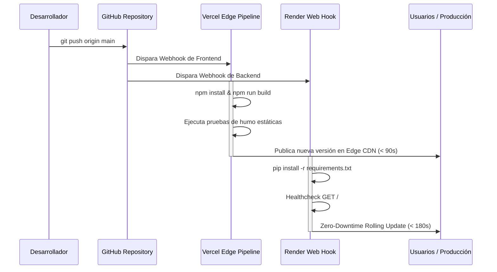

# Guía de Despliegue, Infraestructura y Entornos

> **NOVA WORD — Deployment & Infrastructure Guide**  
> **Plataformas de Alojamiento:** Vercel (Frontend SPA) + Render Cloud (FastAPI Backend) + Supabase Cloud (PostgreSQL/Auth/Storage)  
> **Estrategia CI/CD:** Despliegue Continuo disparado por Git Push a `main`

---

## 1. Topología de Entornos



---

## 2. Configuración y Despliegue del Frontend (Vercel)

El frontend está optimizado para distribuirse en la red de borde (Edge CDN) de Vercel como una Single Page Application estática.

### 2.1 Archivo de Configuración `vercel.json`
Ubicado en la raíz del frontend (`frontend/vercel.json`):
```json
{
  "rewrites": [
    {
      "source": "/(.*)",
      "destination": "/index.html"
    }
  ],
  "headers": [
    {
      "source": "/(.*)",
      "headers": [
        {
          "key": "X-Content-Type-Options",
          "value": "nosniff"
        },
        {
          "key": "X-Frame-Options",
          "value": "DENY"
        },
        {
          "key": "X-XSS-Protection",
          "value": "1; mode=block"
        },
        {
          "key": "Referrer-Policy",
          "value": "strict-origin-when-cross-origin"
        }
      ]
    }
  ]
}
```

### 2.2 Variables de Entorno en Vercel Dashboard
| Variable | Descripción | Ámbito |
| :--- | :--- | :--- |
| `VITE_SUPABASE_URL` | URL pública de la instancia de Supabase | Producción / Preview |
| `VITE_SUPABASE_ANON_KEY` | Clave anónima pública de Supabase | Producción / Preview |
| `VITE_API_URL` | URL base del backend FastAPI en Render | Producción / Preview |

### 2.3 Comando de Construcción y Salida
- **Build Command:** `npm run build`
- **Output Directory:** `dist`
- **Install Command:** `npm install`

---

## 3. Configuración y Despliegue del Backend (Render)

El backend se aprovisiona mediante Infraestructura como Código (IaC) a través de `render.yaml`.

### 3.1 Manifiesto `render.yaml` Verificado
```yaml
services:
  - type: web
    name: nova-word-backend
    env: python
    region: oregon # o ohio (pendiente de verificación)
    plan: starter # escalable según carga operativa
    buildCommand: "pip install -r requirements.txt"
    startCommand: "gunicorn -w 4 -k uvicorn.workers.UvicornWorker main:app --bind 0.0.0.0:$PORT"
    healthCheckPath: /
    envVars:
      - key: PYTHON_VERSION
        value: 3.11.8
      - key: SUPABASE_URL
        sync: false
      - key: SUPABASE_SERVICE_ROLE_KEY
        sync: false
      - key: SUPABASE_JWT_SECRET
        sync: false
      - key: ANTHROPIC_API_KEY
        sync: false
      - key: FRONTEND_URL
        value: https://app.nova-word.com
```

### 3.2 Parámetros Operativos del Worker Gunicorn
- `-w 4`: Inicializa 4 procesos de trabajo concurrentes para distribuir las cargas de inferencia y peticiones I/O.
- `-k uvicorn.workers.UvicornWorker`: Emplea la clase de worker asíncrona de alto rendimiento compatible con ASGI.
- `--bind 0.0.0.0:$PORT`: Enlaza dinámicamente con el puerto expuesto por el balanceador de carga de Render.

---

## 4. Pipeline de Integración y Entrega Continua (CI/CD)



### 4.1 Estrategia de Rollback
1. **Frontend (Vercel):** Se puede revertir instantáneamente en menos de 10 segundos desde el panel de Vercel seleccionando el despliegue previo exitoso y haciendo clic en **"Instant Rollback"**.
2. **Backend (Render):** Se revierte desde la pestaña de **"Deploys"** de Render haciendo clic en **"Rollback to this deploy"** sobre una compilación previa estable.
3. **Base de Datos (Supabase):** Si una migración SQL fallase, se debe ejecutar el script `DOWN` correspondiente previamente probado en staging (ver [SDLC.md](../flujos/SDLC.md)).

---

## 5. Gestión de Secretos y Llaves Criptográficas

- **Almacenamiento Seguro:** Ninguna credencial de producción (`SUPABASE_SERVICE_ROLE_KEY`, `ANTHROPIC_API_KEY`) reside en texto claro dentro del repositorio git.
- **Acceso:** Exclusivo para el Administrador de Infraestructura / DevOps con autenticación de dos factores (2FA).
- **Rotación:** Las credenciales de servicios externos deben rotarse cada 90 días (`pendiente de verificación`).

---

*Documento enlazado a [INDICE_MAESTRO.md](../INDICE_MAESTRO.md), [manual_operacion_monitoreo.md](manual_operacion_monitoreo.md) y [SDLC.md](../flujos/SDLC.md).*
