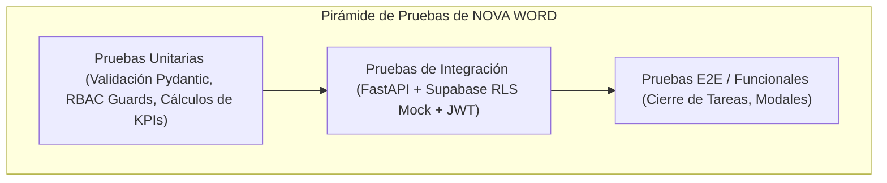

# Guía Integral de Pruebas y Aseguramiento de Calidad (QA)

> **NOVA WORD — Testing Strategy & Quality Assurance**  
> **Arnés de Pruebas:** Pytest (Backend) + Vitest (Frontend) | **Objetivo de Cobertura:** ≥ 80% en componentes críticos

---

## 1. Pirámide y Estrategia de Pruebas



---

## 2. Pruebas de Backend (Python / Pytest)

El backend cuenta con una suite automatizada basada en `pytest`, `pytest-asyncio` y `httpx`.

### 2.1 Configuración `pytest.ini`
Ubicado en `backend/pytest.ini`:
```ini
[pytest]
asyncio_mode = auto
testpaths = tests
python_files = test_*.py
python_classes = Test*
python_functions = test_*
addopts = -v --strict-markers --tb=short
```

### 2.2 Cobertura de Pruebas Existentes
| Archivo de Prueba | Componente Auditado | Aspectos Validados |
| :--- | :--- | :--- |
| `backend/tests/test_auth.py` | `verify_jwt`, `require_admin_or_manager` | - Rechazo de solicitudes sin header `Authorization` (401).<br>- Rechazo de tokens con firma falsa o expirados.<br>- Bloqueo a colaboradores de Nivel 3 en endpoints gerenciales (403). |
| `backend/tests/test_employees.py` | Endpoints administrativos `/api/v1/admin/*` | - Creación de empleados vía `service_role`.<br>- Validación de formato de email institucional.<br>- Modificación de estados de aprobación (`approved`, `suspended`). |
| `backend/tests/test_tasks.py` | Gestión de tareas y evidencias | - Creación de pendientes ad-hoc con fecha límite.<br>- Registro obligatorio de justificación en cancelaciones.<br>- Agregación de métricas de cumplimiento diario. |

### 2.3 Ejecución de Pruebas en el Backend
```bash
# 1. Ingresar al entorno virtual de backend
cd backend
source .venv/bin/activate  # En Linux/macOS
# .venv\Scripts\activate   # En Windows

# 2. Ejecutar la suite completa de pruebas
pytest

# 3. Ejecutar pruebas con reporte de cobertura detallado
pytest --cov=. --cov-report=term-missing --cov-report=html
```

---

## 3. Pruebas de Frontend (Vue 3 / Vitest)

### 3.1 Alcance de Pruebas Unitarias y de Componentes
1. **Guards de Navegación (`src/router/index.js`):**
   - Validar que un usuario sin sesión sea redirigido forzosamente a `/login`.
   - Validar que un usuario en estado `pending` o `suspended` sea expulsado con `signOut()`.
   - Validar que rutas con `leaderOnly` o `managerOnly` bloqueen a colaboradores estándar enviándolos a `/workspace`.
   - Validar que `/kpis` sea accesible solo para analistas de datos o master admins.
2. **Componentes Visuales:**
   - `EvidenceModal.vue`: Verificar que el botón "Confirmar" permanezca inhabilitado si el usuario selecciona "Realizado" pero no adjunta foto o descripción.
   - `Navbar.vue`: Comprobar que los módulos restringidos no se rendericen en el DOM para roles sin privilegios.

### 3.2 Comandos de Ejecución en Frontend
```bash
cd frontend

# Ejecutar pruebas unitarias en modo interactivo
npm run test:unit

# Ejecutar pruebas una sola vez con cobertura
npm run test:coverage
```

---

## 4. Estrategia de Mocking y Dobles de Prueba

Para garantizar que la suite de pruebas se ejecute rápidamente y sin costos en entornos CI/CD (GitHub Actions), se aplican las siguientes reglas:
1. **Llamadas a Anthropic API:**
   - Nunca llamar a la API real de Anthropic en pruebas automatizadas.
   - Se intercepta el cliente utilizando `unittest.mock.AsyncMock` retornando estructuras predecibles de KPIs o respuestas RAG.
2. **Supabase PostgREST:**
   - Se emplea una base de datos de prueba local efímera o mocks para simular las respuestas de tablas `profiles`, `roles` y `tasks`.
3. **Supabase Storage:**
   - La subida binaria de fotos se simula en memoria utilizando objetos `io.BytesIO`.

---

*Documento enlazado a [INDICE_MAESTRO.md](../INDICE_MAESTRO.md), [SDLC.md](../flujos/SDLC.md) y [arquitectura_backend.md](arquitectura_backend.md).*
