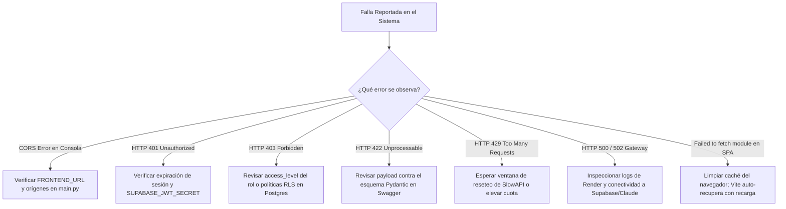

# Guía de Diagnóstico y Resolución de Problemas (Troubleshooting)

> **NOVA WORD — Diagnostic & Troubleshooting Runbook**  
> **Audiencia:** Desarrolladores, Soporte Técnico Nivel 2/3, Administradores de Sistemas

---

## 1. Árbol de Decisión Rápido por Código de Error



---

## 2. Diagnóstico y Remediación Detallada

### 2.1 Error de CORS (Cross-Origin Resource Sharing)
- **Síntoma:** El navegador bloquea la petición hacia `https://api.nova-word.com` mostrando en la consola de herramientas de desarrollo: `Access to XMLHttpRequest at '...' from origin '...' has been blocked by CORS policy`.
- **Causa Raíz:** El dominio desde el cual se emitió la petición (ej. una nueva URL de preview de Vercel) no está registrado en la lista de orígenes permitidos de `CORSMiddleware`.
- **Procedimiento de Solución:**
  1. Abrir `backend/main.py`.
  2. Localizar la lista `allow_origins`.
  3. Asegurar que el dominio esté incluido o que coincida con el patrón permitido:
     ```python
     allow_origins=[
         "http://localhost:5173",
         "https://*.vercel.app",
         "https://app.nova-word.com"
     ]
     ```
  4. Desplegar los cambios al backend en Render.

---

### 2.2 Error HTTP 401: Unauthorized
- **Síntoma:** Llamadas a `/api/v1/roles`, `/api/v1/admin/employees` o `/api/v1/chat` retornan `{"detail": "Could not validate credentials"}`.
- **Causas Comunes:**
  1. La sesión del usuario expiró (el token JWT de Supabase tiene típicamente una validez de 1 hora).
  2. La variable `SUPABASE_JWT_SECRET` en Render no coincide con la firma real del proyecto de Supabase.
- **Procedimiento de Solución:**
  1. En el frontend, cerrar sesión y volver a ingresar para renovar el `refresh_token`.
  2. Si el fallo es generalizado para todos los usuarios: ingresar a **Supabase Dashboard → Project Settings → API → JWT Secret**, copiar el secreto y actualizar la variable `SUPABASE_JWT_SECRET` en el dashboard de Render. Reiniciar el servicio.

---

### 2.3 Error HTTP 403: Forbidden
- **Síntoma:** El usuario ve un banner de error o la consola muestra `{"detail": "Permisos insuficientes para esta operación"}`.
- **Causas Comunes:**
  1. **Violación de Nivel de Rol:** Un colaborador con `access_level: 3` intentó acceder a una función reservada para Gerentes (`access_level: 1`) o Líderes (`access_level: 2`).
  2. **Bloqueo por Estado de Aprobación:** La cuenta está en estado `pending`, `suspended` o `rejected` en la tabla `profiles`.
  3. **Violación de Row Level Security (RLS):** El usuario intentó leer o editar un registro que pertenece a otra área u otra empresa sin ser Master Admin.
- **Procedimiento de Solución:**
  1. Verificar el registro del usuario en la base de datos:
     ```sql
     SELECT p.id, p.full_name, p.approval_status, p.is_master_admin, r.name, r.access_level
     FROM profiles p
     LEFT JOIN roles r ON p.role_id = r.id
     WHERE p.id = '<USER_UUID>';
     ```
  2. Si correspondía una aprobación, un Líder o Master Admin debe cambiar `approval_status` a `'approved'` desde el módulo de `/rrhh`.

---

### 2.4 Error HTTP 422: Unprocessable Entity
- **Síntoma:** Al invocar un endpoint `POST` o `PUT` se retorna un detalle de validación indicando campos faltantes o tipos incompatibles.
- **Causa Raíz:** Discrepancia entre el JSON enviado por el cliente y el modelo Pydantic declarado en `backend/main.py`.
- **Procedimiento de Solución:**
  1. Abrir la documentación interactiva Swagger en `/docs` del backend.
  2. Cotejar los tipos de datos requeridos (ej. enviar un string en lugar de un array, o UUID malformado).
  3. Modificar el emisor en el frontend para ajustar el payload.

---

### 2.5 Error HTTP 429: Too Many Requests
- **Síntoma:** Mensaje en pantalla `429 Too Many Requests: Rate limit exceeded`.
- **Causa Raíz:** Se sobrepasaron las solicitudes permitidas por SlowAPI (ej. más de 15 mensajes por minuto en el chat de IA).
- **Procedimiento de Solución:**
  1. Esperar 60 segundos hasta que la ventana de tiempo del limitador expire.
  2. Si la operación requiere mayor holgura (ej. pruebas masivas en staging), ajustar temporalmente los decoradores `@limiter.limit("...")` en `backend/main.py`.

---

### 2.6 Error en Frontend: "Failed to fetch dynamically imported module"
- **Síntoma:** El usuario navega entre vistas y la pantalla se queda en blanco mostrando en consola: `TypeError: Failed to fetch dynamically imported module`.
- **Causa Raíz:** Se desplegó una nueva versión del frontend en Vercel, invalidando los hashes de los chunks anteriores en la caché del navegador.
- **Mecanismo de Auto-Recuperación Implementado:**
  En `src/router/index.js`, el manejador `router.onError` detecta este error y fuerza automáticamente una recarga completa de la ventana (`window.location.href = to.fullPath`), descargando los chunks actualizados de forma transparente.

---

### 2.7 Fallas en la Carga de Fotografías y Evidencias a Storage
- **Síntoma:** La subida de imagen falla con código `400 Bad Request` o `StorageApiError`.
- **Causas Comunes:**
  1. El archivo excede el tamaño máximo permitido (5 MB).
  2. El bucket `profile_photos` o `task_evidence` no tiene permisos de inserción configurados en Supabase Storage.
- **Procedimiento de Solución:**
  1. Verificar las políticas del bucket en Supabase Storage:
     ```sql
     -- Asegurar que usuarios autenticados puedan subir archivos a su propia carpeta
     CREATE POLICY "Permitir subida a usuarios autenticados" 
     ON storage.objects FOR INSERT TO authenticated 
     WITH CHECK (bucket_id IN ('profile_photos', 'task_evidence'));
     ```

---

*Documento enlazado a [INDICE_MAESTRO.md](../INDICE_MAESTRO.md), [manual_operacion_monitoreo.md](manual_operacion_monitoreo.md) y [api_contratos.md](api_contratos.md).*
