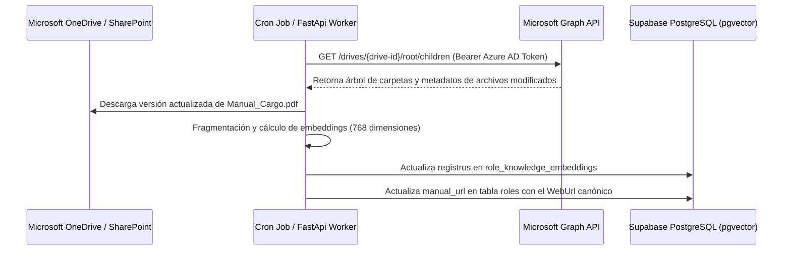

# Guía de Integración con Microsoft OneDrive y Documentación Institucional

> **NOVA WORD — Microsoft 365 & OneDrive Integration Guide**  
> **Ámbito:** Vinculación de Manuales de Cargo, Actas de Procedimiento y Repositorio Corporativo  
> **Empresas:** Elite Nutrition S.A.S. & Futupro Colombia

---

## 1. Topología Actual y Arquitectura de Integración

Actualmente, toda la documentación oficial de los cargos (descripciones de funciones, perfiles de competencias, flujogramas de auditoría y protocolos SST) reside en el entorno institucional de **Microsoft OneDrive / SharePoint**:

```mermaid
graph TD
    subgraph "Nube de Microsoft 365 (OneDrive / SharePoint)"
        RootOneDrive["Carpeta Raíz: /DOCUMENTACION_OFICIAL/"]
        AreaElite["/ELITE_NUTRITION/"]
        AreaFutupro["/FUTUPRO/"]
        
        SubBodega["/Operaciones_y_Bodega/"]
        SubCont["/Contabilidad_y_Finanzas/"]
        SubAud["/Auditoria_Pentagono/"]
        
        PDF_Cargo1["Manual_Analista_Inventarios.pdf"]
        PDF_Cargo2["Protocolo_Cierre_Contable.pdf"]
    end

    subgraph "NOVA WORD (Base de Datos & Frontend)"
        RolesTable[("Tabla roles\n- id (UUID)\n- name (TEXT)\n- manual_url (TEXT)\n- onedrive_folder_id (TEXT)")]
        UI_RoleModal["RoleModal.vue / ManualsManager.vue\n(Botón: 'Consultar Manual en OneDrive')"]
        AI_RAG["FastAPI Knowledge Base (Embeddings de Manuales)"]
    end

    RootOneDrive --> AreaElite
    RootOneDrive --> AreaFutupro
    AreaElite --> SubBodega
    AreaElite --> SubCont
    AreaElite --> SubAud
    SubBodega --> PDF_Cargo1
    SubCont --> PDF_Cargo2

    PDF_Cargo1 -. Enlace Compartido HTTPS .-> RolesTable
    RolesTable --> UI_RoleModal
    PDF_Cargo1 -. Ingesta semántica .-> AI_RAG
```



---

## 2. Estructura Jerárquica Estándar en OneDrive

Para garantizar el orden y evitar enlaces rotos, las carpetas corporativas en OneDrive deben seguir la siguiente nomenclatura estricta:

```text
OneDrive Corporativo/
├── 01_ELITE_NUTRITION/
│   ├── DIRECCION_GENERAL/
│   ├── OPERACIONES_Y_LOGISTICA/
│   │   ├── CARGO_Gerente_Operaciones/
│   │   │   ├── Manual_Funciones_2026.pdf
│   │   │   └── Procedimiento_Despacho_Nacional.pdf
│   │   └── CARGO_Analista_Inventarios/
│   │       ├── Manual_Funciones_2026.pdf
│   │       └── Guia_Conteo_Ciclico.pdf
│   ├── CONTABILIDAD_Y_FINANZAS/
│   └── AUDITORIA_PENTAGONO/
└── 02_FUTUPRO/
    ├── ADMINISTRACION/
    └── COMERCIAL_Y_VENTAS/
```

---

## 3. Vinculación Actual en el Sistema

1. **Generación del Enlace en OneDrive:**
   - El Líder o Talento Humano hace clic derecho sobre el archivo o carpeta del cargo en OneDrive.
   - Selecciona **"Compartir"** con el permiso: *"Cualquier persona en la organización con el enlace puede ver"*.
2. **Registro en NOVA WORD:**
   - En el módulo de administración de cargos o mediante la tabla `roles`, se asienta la URL en el campo `manual_url`.
3. **Consumo por el Colaborador:**
   - Al abrir la ficha de su cargo en `/workspace` o en `/mapa-cargos`, el colaborador presiona el botón con el icono de OneDrive y el documento se visualiza instantáneamente en el visor oficial de Microsoft Office Online sin necesidad de descargar archivos locales.

---

## 4. Hoja de Ruta: Integración Automatizada con Microsoft Graph API

> [!TIP]
> **Evolución Técnica Planeada (`pendiente de verificación`):**  
> Para prescindir del pegado manual de enlaces y mantener los manuales sincronizados automáticamente con el motor RAG de IA, se proyecta implementar un conector directo vía **Microsoft Graph**.



### Requisitos Técnicos para la Integración:
- Registro de aplicación en **Microsoft Entra ID (Azure AD)** para la organización.
- Permisos de Graph de solo lectura a nivel de aplicación: `Files.Read.All`, `Sites.Read.All`.
- Variables de entorno backend requeridas:
  - `AZURE_TENANT_ID`
  - `AZURE_CLIENT_ID`
  - `AZURE_CLIENT_SECRET`

---

*Documento enlazado a [INDICE_MAESTRO.md](../INDICE_MAESTRO.md), [manual_modulos_especiales.md](../usabilidad/manual_modulos_especiales.md) y [arquitectura_backend.md](arquitectura_backend.md).*
