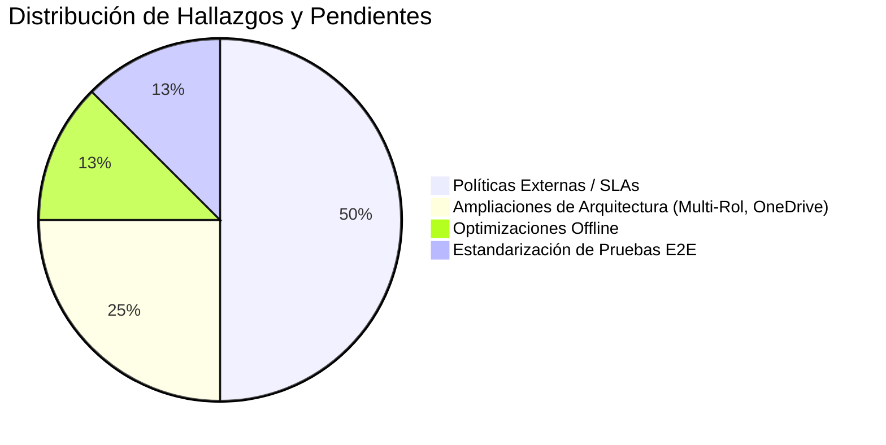

# Inventario de Documentación Pendiente y Límites del Sistema

> **NOVA WORD — Technical Debt & Verification Inventory**  
> **Cláusula de Rigor:** Este documento cataloga con absoluta transparencia técnica las áreas, políticas o configuraciones que actualmente no están directamente codificadas en el repositorio o que requieren confirmación gerencial/operativa externa bajo la cláusula estricta de `pendiente de verificación`.

---

## 1. Políticas Operativas y Acuerdos de Nivel de Servicio (SLAs)

| Ítem / Proceso | Estado de Verificación | Descripción y Necesidad de Definición |
| :--- | :---: | :--- |
| **SLA de Disponibilidad de la Plataforma** | `pendiente de verificación` | No existe un contrato formal de SLA firmado con los proveedores de hosting (Render Starter y Supabase Pro). Se asume una meta de 99.5% de disponibilidad mensual, pero carece de respaldo legal. |
| **Política de Retención de Evidencias Fotográficas** | `pendiente de verificación` | Actualmente, los archivos en el bucket `task_evidence` se conservan indefinidamente. Debe definirse formalmente si las evidencias se archivan tras 6 meses, 1 año o 5 años para evitar la saturación de espacio. |
| **Costos Operativos de Inteligencia Artificial** | `pendiente de verificación` | El consumo de tokens en Anthropic API (Claude 3.5 Sonnet) varía según la concurrencia en `/api/v1/chat` y `/api/v1/generate-kpis`. Falta definir un presupuesto mensual límite y una alarma de facturación en el gateway de Anthropic. |
| **Frecuencia y Simulacros de Disaster Recovery (DRP)** | `pendiente de verificación` | Las copias de seguridad de Supabase se ejecutan a diario, pero no se ha documentado un calendario formal de simulacros periódicos de recuperación ante desastres en un clúster secundario. |

---

## 2. Limitaciones Técnicas Conocidas y Deuda Arquitectural

### 2.1 Asignación de Múltiples Roles por Usuario (Multi-Cargo)
- **Estado Actual:** En la tabla `profiles`, la columna `role_id` es una relación foránea de uno a uno (`role_id UUID REFERENCES roles(id)`).
- **Limitación:** Si un colaborador asume dos cargos simultáneos en la organización (ej. Líder de Compras y Coordinador de Inventarios temporal), el sistema actualmente exige crear dos cuentas de usuario independientes o conmutar manualmente el `role_id`.
- **Evolución Planeada:** Migrar hacia una tabla intermedia `profile_roles (profile_id, role_id, is_primary, assigned_at)` para soportar perfiles multi-cargo de forma nativa.

### 2.2 Integración con Microsoft OneDrive para Documentación
- **Estado Actual:** Los manuales y actas de cargo se enlazan mediante hipervínculos manuales (`manual_url`) hacia carpetas compartidas de Microsoft OneDrive.
- **Limitación:** No existe sincronización bidireccional automática mediante la API de Microsoft Graph. Si un archivo es renombrado o movido dentro de OneDrive, el enlace dentro de NOVA WORD puede quedar roto.
- **Evolución Planeada:** Desarrollar un conector en FastAPI utilizando Azure AD App Registration para leer el árbol de carpetas de OneDrive en tiempo real (`pendiente de verificación`).

### 2.3 Modo Fuera de Línea (Offline Support) en Bodega
- **Estado Actual:** La aplicación requiere conectividad a Internet activa y constante para autenticarse contra Supabase y enviar las fotos de evidencia.
- **Limitación:** Si un operario se encuentra en una zona sin cobertura celular dentro de las bodegas de almacenamiento de Elite Nutrition, no puede confirmar tareas en tiempo real.
- **Evolución Planeada:** Implementar Service Workers y almacenamiento local en IndexedDB con sincronización diferida (Background Sync).

### 2.4 Soporte de Videos en el Módulo de Usuario y Academia
- **Estado Actual:** La vista de Academia (`AcademiaElite.vue`) presenta la estructura básica de layout pero carece de un modelo relacional persistente para vincular videos específicos a cada rol.
- **Cambio en Desarrollo:** Incorporación de un catálogo audiovisual con reproductor de video integrado para guías paso a paso, inducciones de cargo y capacitaciones operativas.
- **Evolución Planeada:** Creación de las tablas `role_videos` y `user_video_progress` para registrar la visualización obligatoria de cápsulas formativas antes de certificar la operatividad del colaborador en su puesto (ver detalle de diseño en [manual_modulos_especiales.md](../usabilidad/manual_modulos_especiales.md)).

---

## 3. Matriz de Seguimiento y Hallazgos de Auditoría

---

*Documento enlazado a [INDICE_MAESTRO.md](../INDICE_MAESTRO.md), [SDLC.md](../flujos/SDLC.md) y [manual_operacion_monitoreo.md](manual_operacion_monitoreo.md).*
