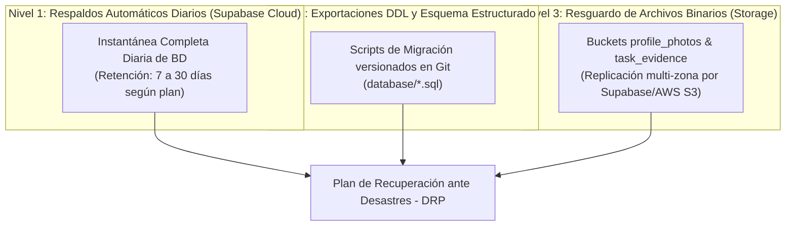

# Manual de Operación, Monitoreo y Mantenimiento SRE

> **NOVA WORD — Operations & Site Reliability Engineering Manual**  
> **Audiencia:** Operadores de Sistemas, Ingenieros DevOps / SRE, Administradores de Base de Datos  
> **Objetivo de Disponibilidad (SLA):** 99.5% de disponibilidad mensual (`pendiente de verificación`)

---

## 1. Puntos de Chequeo de Salud (Healthchecks)

El backend expone un endpoint raíz liviano diseñado para sondas de disponibilidad (liveness & readiness probes):

### 1.1 Endpoint Principal
- **URL:** `GET /`
- **Respuesta Esperada (200 OK):**
```json
{
  "status": "healthy",
  "service": "NOVA WORD Backend Engine",
  "version": "1.0.0"
}
```
- **Intervalo de Sondeo Recomendado:** Cada 30 segundos con timeout de 5 segundos.
- **Umbral de Falla:** 3 fallos consecutivos disparan el reinicio automático del worker en Render.

---

## 2. Gestión del Conexiones y Pooling en Supabase (Supavisor)

Para evitar la saturación de conexiones en PostgreSQL ante picos de concurrencia:
- **Pooler Nativo:** Supabase utiliza **Supavisor** como capa de pooling transaccional en el puerto `6543`.
- **Modo de Operación:** Transaction Mode para endpoints que ejecutan queries breves y desconectan; Session Mode exclusivo para migraciones DDL pesadas.
- **Límite de Conexiones por Worker:** Cada worker de Gunicorn mantiene un pool máximo de 10 conexiones activas a Supabase, evitando agotar el límite de conexiones del clúster (`pendiente de verificación`).

---

## 3. Estrategia de Copias de Seguridad (Backups) y Recuperación



### 3.1 Objetivos de Recuperación
- **RPO (Recovery Point Objective):** < 24 horas para datos operacionales mediante snapshots automáticos diarios (`pendiente de verificación`).
- **RTO (Recovery Time Objective):** < 2 horas para restaurar el servicio completo en una nueva instancia de base de datos.

### 3.2 Procedimiento de Restauración Manual
1. En caso de corrupción severa, ingresar al panel de **Supabase Dashboard → Settings → Database → Backups**.
2. Seleccionar el punto de restauración deseado y hacer clic en **"Restore"**.
3. Verificar la integridad de las tablas maestras (`profiles`, `roles`, `role_task_templates`).
4. Reanudar el tráfico redirigiendo los workers de Render.

---

## 4. Métricas Clave y Umbrales de Alerta

| Métrica | Herramienta de Monitoreo | Umbral de Alerta | Acción Inmediata Requerida |
| :--- | :--- | :--- | :--- |
| **Tiempo de Respuesta (p95)** | Render Analytics / Datadog | > 1.500 ms (durante 5 min) | Analizar logs de consultas lentas en Postgres y llamadas a Anthropic. |
| **Tasa de Errores 5xx** | Render Webhook / Sentry | > 1% del tráfico total | Inspeccionar trazas en Render por fallos de red o llaves de API expiradas. |
| **Tasa de Errores 429** | SlowAPI Logs | > 50 eventos / hora | Evaluar si un bot o usuario legítimo está enviando ráfagas no deseadas. |
| **Uso de CPU en Base de Datos** | Supabase Metrics | > 80% sostenido | Revisar si faltan índices en columnas de búsqueda frecuente (`role_id`, `created_at`). |
| **Espacio en Storage** | Supabase Storage Usage | > 85% de cuota contratada | Programar purga de evidencias antiguas de tareas canceladas (`pendiente de verificación`). |

---

## 5. Mantenimiento Preventivo de Índices y Vectores

- **Monitoreo de Índices pgvector:** Las columnas que almacenan embeddings de 768 dimensiones en `role_knowledge_embeddings` utilizan índices `ivfflat` o `hnsw`. Conforme se agreguen cientos de manuales, se recomienda ejecutar periódicamente un `REINDEX` durante ventanas de bajo tráfico (ej. domingos a las 02:00 AM) para mantener la velocidad de búsqueda de similitud.
- **Vacío y Análisis (Vacuum):** Supabase ejecuta `autovacuum` de manera transparente; no obstante, tras migraciones masivas de usuarios, ejecutar `ANALYZE profiles; ANALYZE tasks;` manualmente.

---

*Documento enlazado a [INDICE_MAESTRO.md](../INDICE_MAESTRO.md), [despliegue_y_entorno.md](despliegue_y_entorno.md) y [guia_troubleshooting.md](guia_troubleshooting.md).*
