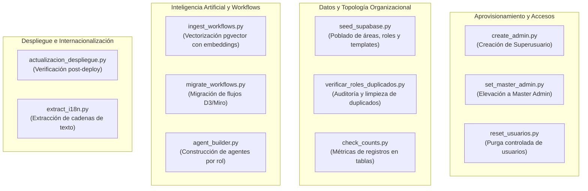

# Manual de Scripts Operativos y Mantenimiento CLI

> **NOVA WORD — CLI Administration & Maintenance Runbook**  
> **Directorio:** `scripts/` | **Entorno de Ejecución:** Python 3.11 / Supabase Admin SDK  
> **Audiencia:** Ingenieros DevOps, Desarrolladores Backend, Administradores de Base de Datos

---

## 1. Inventario General de Scripts en `scripts/`

El directorio `scripts/` contiene rutinas automatizadas para aprovisionamiento, sanitización de datos, vectorización semántica y tareas de mantenimiento del clúster de Supabase:



---

## 2. Aprovisionamiento y Control de Cuentas

### 2.1 `create_admin.py` (Creación de Superadministrador Inicial)
- **Propósito:** Provee una cuenta raíz de tipo Master Admin cuando la plataforma se instala desde cero, creando el usuario en `auth.users` mediante la API de administración de Supabase (`service_role`) y su correspondiente perfil en `public.profiles`.
- **Variables Requeridas en `.env.local`:** `SUPABASE_URL`, `SUPABASE_SERVICE_ROLE_KEY`.
- **Modo de Uso:**
```bash
python scripts/create_admin.py --email admin@elitenutrition.com --password "MasterPassword2026!" --name "Administrador Maestro"
```
- **Salida Esperada:**
```text
[INFO] Conectando a Supabase vía Service Role...
[INFO] Usuario creado en auth.users con UUID: 550e8400-e29b-41d4-a716-446655440000
[INFO] Perfil insertado en public.profiles con is_master_admin=True, approval_status='approved'.
[SUCCESS] Administrador Maestro configurado exitosamente.
```

### 2.2 `set_master_admin.py` (Elevación de Privilegios a Cuenta Existente)
- **Propósito:** Convierte a un colaborador ya registrado en Master Admin o restablece su acceso administrativo.
- **Uso:**
```bash
python scripts/set_master_admin.py --email sebas@elitenutrition.com
```

### 2.3 `reset_usuarios.py` (Purga Controlada de Usuarios de Prueba)
- **Propósito:** Elimina de manera segura las cuentas de prueba creadas durante fases de QA en `auth.users` y cascada en `profiles`, conservando intactos los catálogos organizacionales (`areas`, `roles`, `role_task_templates`).
- **Seguridad:** Solicita confirmación explícita escribiendo `CONFIRMAR_PURGA` en consola.

---

## 3. Topología Organizacional y Sanidad de Datos

### 3.1 `seed_supabase.py` (Semillero de Estructura Empresarial)
- **Propósito:** Inserta el catálogo oficial de áreas (Dirección General, Operaciones, Contabilidad, Auditoría, Comercial) y los cargos formales con sus respectivas relaciones de supervisión para **Elite Nutrition S.A.S.** y **Futupro**.
- **Idempotencia:** Utiliza cláusulas `ON CONFLICT (name, area_id) DO NOTHING` evitando generar registros duplicados al reejecutarse.
- **Uso:**
```bash
python scripts/seed_supabase.py
```

### 3.2 `verificar_roles_duplicados.py` (Detección de Duplicados en Organigrama)
- **Propósito:** Audita la tabla `roles` en busca de nombres homónimos con espacios en blanco o diferencias de mayúsculas (ej. *"Gerente Auditoria"* vs *"Gerente de Auditoría"*).
- **Acción:** Emite un reporte en formato tabla indicando qué IDs deben unificarse y ejecuta la reasignación de empleados asociados hacia el cargo maestro antes de eliminar la fila redundante.

### 3.3 `check_counts.py` (Telemetría Rápida de Registros)
- **Propósito:** Imprime en consola un conteo consolidado de registros por tabla:
```text
==================================================
TABLA                           REGISTROS ACTIVOS
==================================================
areas                           5
roles                           28
profiles                        42
role_task_templates             112
tasks                           340
role_knowledge_embeddings       850
==================================================
```

---

## 4. Inteligencia Artificial y Vectores Semánticos

### 4.1 `ingest_workflows.py` (Ingesta y Embeddings de Manuales)
- **Propósito:** Lee los manuales de funciones y directivas operativas ubicados en `directivas/` o archivos PDF/Markdown, los fragmenta en bloques (chunks de 500 tokens con overlap de 50 tokens), calcula sus representaciones vectoriales de 768 dimensiones y los inserta en `role_knowledge_embeddings` para nutrir el Oráculo RAG.
- **Uso:**
```bash
python scripts/ingest_workflows.py --role-id <ROLE_UUID> --source-dir directivas/
```

### 4.2 `migrate_workflows.py` (Migración de Grafos y Mapas)
- **Propósito:** Sincroniza las representaciones estructurales de los procesos interdepartamentales hacia la tabla `role_workflows` para ser consumidos por la vista tridimensional de Three.js (`/mapa-procesos`).

---

## 5. Automatización de Despliegues y Verificación

### 5.1 `actualizacion_despliegue.py`
- **Propósito:** Script de validación post-despliegue ejecutado en entornos CI/CD:
  1. Verifica que la API de FastAPI responda `200 OK` en `GET /`.
  2. Comprueba que las tablas críticas de PostgreSQL tengan RLS activo.
  3. Valida la latencia del WebSocket de Supabase Realtime.
  4. Envía notificación de éxito o alerta de fallo.

---

*Documento enlazado a [INDICE_MAESTRO.md](../INDICE_MAESTRO.md), [instalacion_configuracion.md](../instalacion_configuracion.md) y [SDLC.md](../flujos/SDLC.md).*
