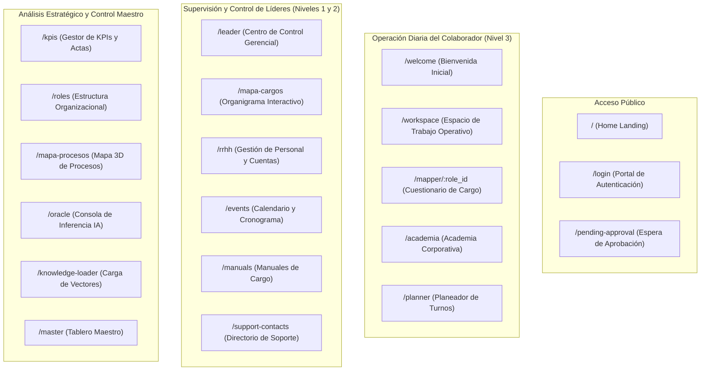

# Catálogo Exhaustivo de Pantallas, Vistas y Componentes Visuales

> **NOVA WORD — Interface Catalog & Component Directory**  
> **Directorio de Vistas:** `frontend/src/views/` | **Componentes:** `frontend/src/components/`  
> **Estilo Visual:** Cyber-Corporate Dark Mode / Glassmorphism / Tailwind CSS

---

## 1. Mapa General de Vistas del Sistema

---

## 2. Catálogo Detallado de Pantallas

### 2.1 Pantallas Públicas y de Acceso

#### Pantalla: `/login` (Portal de Acceso y Registro)
- **Componente:** `LoginView.vue`
- **Audiencia:** Todos los usuarios.
- **Campos de Entrada:**
  - `Correo Electrónico`: Input de tipo email con validación de sintaxis corporativa.
  - `Contraseña`: Input de contraseña con botón para alternar visibilidad.
  - *Modo Registro (SignUp):* Campos adicionales para `Nombre Completo`, `Cédula de Ciudadanía`, `Número Celular`, `Empresa` (Selector: Elite Nutrition / Futupro) y `Cargo Solicitado`.
- **Botones y Acciones:**
  - `Iniciar Sesión`: Autentica credenciales contra Supabase Auth.
  - `Crear Cuenta`: Registra la identidad con `approval_status: 'pending'` y redirige a la vista de espera.
  - `¿Olvidó su contraseña?`: Dispara el correo de recuperación de contraseña de Supabase.
- **Indicadores de Estado:** Mensajes de alerta en rojo para credenciales inválidas; alertas amarillas si la cuenta aún se encuentra pendiente de aprobación.

#### Pantalla: `/pending-approval` (Espera de Aprobación de Cuenta)
- **Componente:** `PendingApprovalView.vue`
- **Audiencia:** Nuevos colaboradores autoregistrados.
- **Elementos Visuales:** Iconografía de reloj de arena, texto informativo indicando que su Líder o Gerente de Área debe activar su usuario desde el módulo de Talento Humano (`/rrhh`), y botón para `Cerrar Sesión` o `Volver al Login`.

---

### 2.2 Espacio de Trabajo del Colaborador

#### Pantalla: `/workspace` (Espacio de Trabajo Diario)
- **Componente:** `EmployeeWorkspace.vue`
- **Audiencia:** Todos los colaboradores autenticados (Niveles 1, 2 y 3).
- **Cuadrantes y Componentes:**
  1. **Encabezado del Colaborador:** Muestra avatar fotográfico, nombre completo, cargo formal, área a la que pertenece y empresa (Elite Nutrition / Futupro).
  2. **Cuadrante de Tareas Rutinarias (Memoria del Cargo):** Lista de chequeo generada dinámicamente desde `role_task_templates` agrupada por periodicidad (Diarias, Semanales, Mensuales).
  3. **Cuadrante de Entregas Programadas:** Tarjetas de compromisos corporativos con fecha límite inminente originadas desde el Centro de Control.
  4. **Cuadrante de Pendientes Ad-Hoc:** Tareas asignadas puntualmente por su líder.
- **Comportamiento Interactivo de Cierre de Tarea:**
  - Al hacer clic sobre cualquier checkbox o tarjeta de tarea, **la tarea no se marca de inmediato**.
  - Se abre instantáneamente la ventana modal emergente de evidencia (`EvidenceModal.vue`).

#### Pantalla: `/mapper/:role_id` (Cuestionario de Mapeo de Cargo)
- **Componente:** `MapperView.vue`
- **Audiencia:** Colaborador asignado a dicho rol o Master Admin.
- **Propósito:** Levantar la información real de funciones, herramientas informáticas utilizadas, dependencias y riesgos operativos que nutren la base de conocimientos de la IA.
- **Campos:** Secciones de preguntas cuantitativas y cualitativas con autoguardado en `role_mappings`.

#### Pantalla: `/academia` (Academia Corporativa)
- **Componente:** `AcademiaElite.vue`
- **Audiencia:** Todos los usuarios autenticados.
- **Propósito:** Centro de capacitación y estandarización donde se publican videos formativos, inductivos y guías de operación para cada puesto de trabajo.

---

### 2.3 Supervisión y Centro de Control de Líderes

#### Pantalla: `/leader` (Centro de Control Gerencial)
- **Componente:** `LeaderDashboard.vue`
- **Audiencia:** Gerentes de Área (`access_level: 1`) y Master Admin.
- **Restricción de Área:** Un Gerente de Contabilidad o Auditoría solo visualiza las métricas y colaboradores subordinados a su propia área.
- **Cuadrantes Principales:**
  1. **Selector de Colaborador:** Listado dinámico de empleados bajo su mando. Al seleccionar uno, se despliega su cumplimiento diario, semáforo de desempeño y tareas activas.
  2. **Asignación de Pendientes y Órdenes Programadas:** Formulario modal para delegar entregables con fecha límite, periodicidad y descripción de la meta.
  3. **Consolidado del Informe Diario:** Pestaña especializada que lista todas las actividades cerradas hoy por el equipo, permitiendo al Gerente auditar fotos de evidencia y justificaciones de incumplimiento.

#### Pantalla: `/mapa-cargos` (Organigrama y Mapa de Cargos)
- **Componente:** `MapaCargos.vue`
- **Audiencia:** Líderes (`access_level: 1, 2`) y Master Admin.
- **Tecnología:** Renderizado en árbol SVG mediante D3.js con zoom, paneo y filtrado anti-duplicados.
- **Acciones:** Clic en un nodo abre `RoleModal.vue` para consultar responsabilidades del cargo, manual de funciones asociado y enlaces a documentación.

#### Pantalla: `/rrhh` (Gestión de Colaboradores y Cuentas)
- **Componente:** `HRDashboard.vue`
- **Audiencia:** Líderes (`access_level: 1, 2`) y Master Admin.
- **Funcionalidades:**
  - Tabla de usuarios con filtros por empresa, área y estado de aprobación (`pending`, `approved`, `suspended`).
  - Botones de acción rápida: **Aprobar**, **Suspender**, **Reasignar Cargo** y **Crear Empleado** (este último invoca `/api/v1/admin/create-employee`).
  - Carga masiva o actualización de cédula y teléfono de contacto.

#### Pantalla: `/events` (Cronograma y Calendario Operativo)
- **Componente:** `EventCalendar.vue`
- **Audiencia:** Líderes y Gerentes.
- **Propósito:** Vista de cuadrícula mensual y semanal que consolida las fechas de cierre contable, comités operativos, auditorías físicas de inventario y entregas programadas.

---

### 2.4 Control Estratégico y Analítica Avanzada

#### Pantalla: `/kpis` (Gestor de KPIs y Actas)
- **Componente:** `KpiManager.vue`
- **Audiencia:** Exclusivo para **Analista/Especialista de Datos** y **Master Admin** (`meta.kpiAccessOnly`).
- **Funcionalidades:**
  - Definición de fórmulas de cálculo para indicadores de gestión.
  - Registro de actas de seguimiento gerencial y metas de cumplimiento.
  - Botón de **"Generar KPIs con IA"**, que invoca a Claude 3.5 Sonnet para estructurar propuestas cuantitativas de acuerdo con el perfil del cargo.

#### Pantalla: `/roles` (Estructura Organizacional y Contraseñas)
- **Componente:** `RolePermissionManager.vue`
- **Audiencia:** Exclusivo **Master Admin** (`meta.masterAdminOnly`).
- **Funcionalidades:**
  - Creación, edición y eliminación de áreas y cargos para toda la compañía.
  - Asignación de niveles jerárquicos de acceso (`access_level` 1, 2 o 3).
  - Panel de delegación de gestión de contraseñas (`password_delegated_roles`).

#### Pantalla: `/mapa-procesos` (Mapa Tridimensional de Procesos)
- **Componente:** `MiroProcessMap.vue`
- **Audiencia:** Exclusivo **Master Admin**.
- **Tecnología:** Escena 3D construida en Three.js que representa la interconexión entre procesos clave (Abastecimiento, Ventas, Logística, Contabilidad) y sus riesgos operativos asociados.

---

## 3. Catálogo de Modales Emergentes Clave

### 3.1 `EvidenceModal.vue` (Modal de Cierre de Tareas)
- **Propósito:** Garantizar que ninguna tarea sea cerrada sin soporte explícito o motivo de incumplimiento.
- **Opciones Seleccionables (Radio Buttons / Tabs):**
  1. **Opción A: Realizado:**
     - `Texto de Evidencia` (Obligatorio, min 10 caracteres): Descripción de lo ejecutado.
     - `Carga de Archivo Fotográfico` (Obligatorio): Selector de archivo binario (soporta arrastrar y soltar o captura de cámara en móviles).
  2. **Opción B: No fue posible cumplir:**
     - `Justificación de Incumplimiento` (Obligatorio, min 15 caracteres): Causa raíz por la cual no se llevó a cabo la tarea (ej. falta de insumos, sistema caído, cliente ausente).
- **Validaciones:** El botón **"Guardar y Confirmar"** permanece deshabilitado hasta que se cumplan las validaciones de longitud y adjunto.

### 3.2 `RoleModal.vue` (Ficha Técnica del Cargo)
- Despliega el resumen de funciones, objetivos del cargo, líder directo, herramientas asignadas y el enlace directo al manual corporativo oficial en OneDrive.

---

*Documento enlazado a [INDICE_MAESTRO.md](../INDICE_MAESTRO.md), [flujos_operativos.md](flujos_operativos.md) y [manual_roles_permisos.md](manual_roles_permisos.md).*
