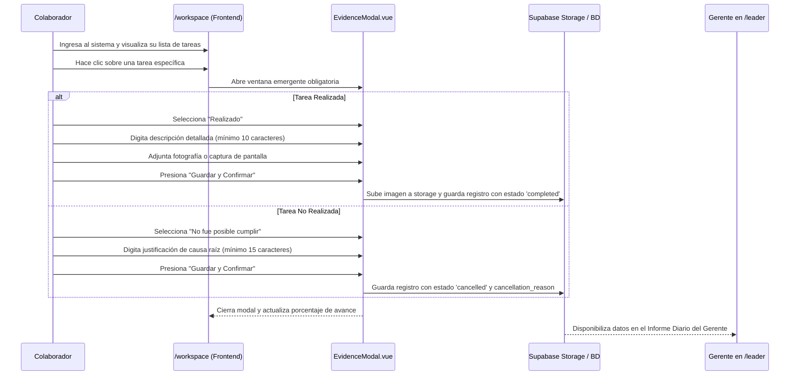
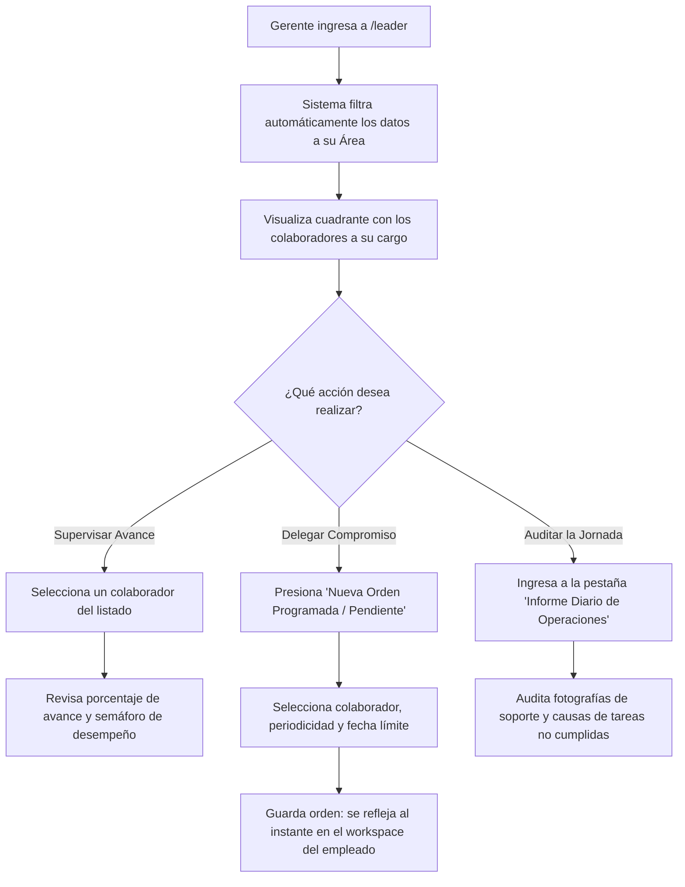

# Flujos Operativos y Procedimientos Paso a Paso

> **NOVA WORD — Standard Operating Procedures (SOP)**  
> **Audiencia:** Usuarios Finales, Colaboradores, Líderes de Área, Analistas y Administradores  
> **Objetivo:** Guiar la interacción operativa diaria garantizando cero ambigüedad funcional.

---

## 1. Flujo Operativo 1: Jornada Diaria del Colaborador (Cierre de Tareas con Evidencia)

Este procedimiento describe la rutina estándar que debe ejecutar todo colaborador al iniciar y finalizar sus labores cotidianas:

### Paso a Paso Detallado para el Colaborador:
1. **Acceso al Espacio de Trabajo:**
   - Ingrese a la plataforma e inicie sesión con su correo y contraseña.
   - Si es su primera vez tras ser aprobado por su líder, el sistema le mostrará la pantalla de bienvenida (`/welcome`). Presione **"Continuar a mi Espacio de Trabajo"**.
2. **Revisión de Tareas:**
   - En `/workspace`, revise sus tres cuadrantes: *Tareas Rutinarias del Cargo*, *Entregas Programadas* y *Pendientes Asignados*.
3. **Ejecución y Cierre con Evidencia:**
   - Al finalizar una actividad física o digital, haga clic sobre la tarjeta de la tarea.
   - **IMPORTANTE:** La tarea **no se marcará automáticamente**. Se desplegará la ventana emergente de verificación.
   - Si completó la tarea:
     - Deje activa la pestaña **"Realizado"**.
     - En el campo *Descripción*, detalle brevemente lo efectuado (ej. *"Se realizó el conteo físico de 50 cajas de Proteína Whey lote 2026-A en estiba 4"*).
     - Haga clic en **"Adjuntar Fotografía / Captura"** y seleccione la foto clara del trabajo ejecutado.
     - Presione **"Guardar y Confirmar"**.
   - Si no pudo completar la tarea:
     - Seleccione la pestaña **"No fue posible cumplir"**.
     - En el campo *Justificación*, explique el motivo exacto (ej. *"No se pudo despachar el pedido debido a que el transporte de la transportadora no se presentó a la bodega"*).
     - Presione **"Guardar y Confirmar"**.
4. **Confirmación Visual:**
   - La tarea cambiará su estado visual (verde para realizada, ámbar/gris para justificada) y el indicador de cumplimiento diario incrementará.

---

## 2. Flujo Operativo 2: Supervisión Gerencial e Informe Diario (Gerente de Área)

Procedimiento para el Gerente o Líder de Nivel 1 en el Centro de Control:

### Paso a Paso para el Gerente de Área:
1. **Ingreso al Centro de Control:**
   - Diríjase al menú superior y presione **"Centro de Control"** (`/leader`).
   - El sistema reconocerá su cargo (ej. *Gerente de Contabilidad* o *Gerente de Operaciones*) y limitará toda la información únicamente a su departamento.
2. **Supervisión de Colaboradores:**
   - En el panel lateral izquierdo, observe el listado de personas a su cargo.
   - Al hacer clic sobre cualquier nombre, se desplegarán sus métricas del día: número de tareas totales, porcentaje de avance y semáforo (Verde: >90%, Amarillo: 75%-89%, Rojo: <75%).
3. **Asignación de Pendientes y Órdenes Programadas:**
   - Presione el botón **"+ Asignar Pendiente / Orden"**.
   - Seleccione el colaborador receptor (el selector solo mostrará miembros de su equipo).
   - Defina el tipo: *Entrega Programada* (con fecha fija de entrega) o *Pendiente Rápido*.
   - Ingrese el título, instrucciones detalladas y fecha límite. Presione **"Asignar"**.
4. **Consulta y Exportación del Informe Diario:**
   - Al final de la jornada laboral, abra la pestaña **"Informe Diario"**.
   - El sistema listará todas las tareas cerradas en el día por su equipo.
   - Haga clic en los enlaces de **"Ver Fotografía"** para auditar que los soportes adjuntados correspondan a la realidad operativa.
   - En caso de tareas no cumplidas, revise las justificaciones para tomar acciones correctivas o reprogramar recursos.

---

## 3. Flujo Operativo 3: Aprobación de Personal y Gestión de Cuentas (Talento Humano)

Procedimiento para Líderes y Administradores en `/rrhh`:

1. **Revisión de Solicitudes Pendientes:**
   - Ingrese a `/rrhh` (Cuentas y Personal).
   - La tabla principal destaca con una insignia amarilla los registros con estado `Pendiente de Aprobación`.
2. **Verificación de Identidad:**
   - Compruebe que el nombre, cédula de ciudadanía, empresa y cargo solicitado correspondan a una contratación formal.
3. **Acción de Activación:**
   - Para aprobar: Haga clic en el botón verde **"Aprobar Colaborador"**. A partir de este momento, el colaborador podrá iniciar sesión y acceder a su espacio de trabajo.
   - Para rechazar: Haga clic en **"Rechazar"** si el registro no corresponde a un empleado corporativo.
   - Para suspender: En caso de desvinculación o permiso laboral, presione **"Suspender Cuenta"**; esto bloqueará el acceso al sistema de forma inmediata.

---

## 4. Flujo Operativo 4: Formulación y Seguimiento de KPIs (Analista de Datos / Master Admin)

Procedimiento para la medición cuantitativa del desempeño en `/kpis`:

1. **Ingreso al Módulo:**
   - Navegue a `/kpis`. Si un usuario que no sea Analista de Datos o Master Admin intenta ingresar, el sistema lo redireccionará a `/workspace`.
2. **Definición de Indicadores:**
   - Seleccione el área y el cargo a evaluar.
   - Puede cargar manualmente un indicador ingresando: *Nombre del KPI*, *Meta Numérica*, *Unidad de Medida* (%, unidades, días) y *Fórmula de Cálculo*.
3. **Asistente de IA (Generación Inteligente):**
   - Si desea recomendaciones analíticas basadas en el manual del cargo, presione el botón **"Generar KPIs con IA"**.
   - El sistema contactará a Claude 3.5 Sonnet, el cual formulará 3 a 5 indicadores estratégicos ponderados con sus respectivas metas cuantitativas.
4. **Registro de Actas de Seguimiento:**
   - En la sección inferior, registre las actas de comités de rendimiento, asentando compromisos, fecha de la sesión y porcentaje de cumplimiento alcanzado en el periodo.

---

## 5. Flujo Operativo 5: Consulta Normativa con el Agente de Cargo (Oráculo IA)

Procedimiento para resolver dudas operativas sin interrumpir a los supervisores:

1. Desde cualquier pantalla o mediante el botón flotante del asistente, abra la **Consola de Consulta del Cargo**.
2. Escriba su duda operativa en lenguaje natural (ej. *"¿Cuál es la política para registrar una devolución por avería en empaque?"*).
3. El sistema consultará la base de conocimientos vectorizada de su manual de funciones y le responderá citando el procedimiento estándar aplicable a Elite Nutrition o Futupro.

---

*Documento enlazado a [INDICE_MAESTRO.md](../INDICE_MAESTRO.md), [catalogo_pantallas.md](catalogo_pantallas.md) y [manual_roles_permisos.md](manual_roles_permisos.md).*
