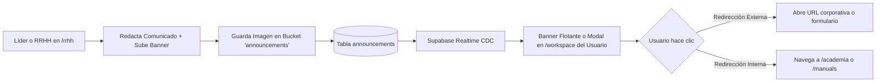
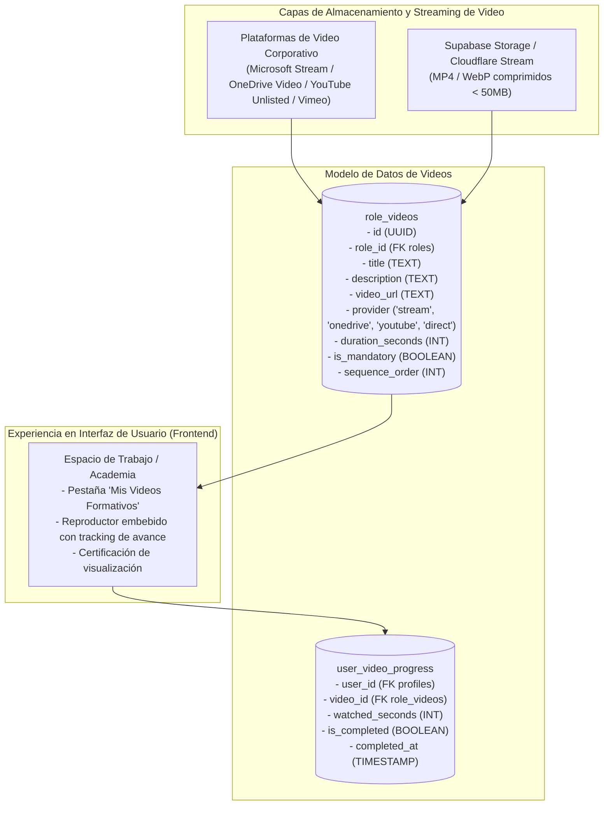

# Manual de Módulos Especiales, Videos y Comunicación Corporativa

> **NOVA WORD — Special Modules & Operational Media Manual**  
> **Audiencia:** Colaboradores, Líderes de Área, Talento Humano y Administradores de Comunicación  
> **Ámbitos:** Noticias y Comunicados, Módulo Audiovisual de Usuario (Videos y Academia), Calendario Operativo y Mesa de Ayuda

---

## 1. Módulo de Noticias y Comunicados Masivos

Diseñado para emitir directrices corporativas, anuncios urgentes o comunicados institucionales tipo *newsletter* con soporte para banners fotográficos y redirecciones interactivas:



### 1.1 Características Funcionales
- **Formato Visual:** Tarjetas estilo boletín informativo con imagen de cabecera panorámica, título destacado, fecha de publicación y texto enriquecido sanitizado con DOMPurify.
- **Botón de Acción (Call to Action - CTA):** Permite configurar un botón personalizado (ej. *"Ver Protocolo Completo"*, *"Diligenciar Encuesta"*, *"Ingresar a Reunión"*) con enlace de redirección.
- **Segmentación:** Opción de dirigir el comunicado exclusivamente a colaboradores de **Elite Nutrition S.A.S.**, **Futupro** o de carácter global para ambas empresas.
- **Almacenamiento de Banners:** Las imágenes se optimizan y alojan en el bucket público `announcements` de Supabase Storage.

---

## 2. Módulo de Videos y Capacitación Audiovisual del Usuario

> [!IMPORTANT]
> **Funcionalidad en Proceso de Incorporación / Arquitectura Prevista:**  
> Actualmente el sistema cuenta con la vista base `AcademiaElite.vue`. Se encuentra en desarrollo la integración nativa de **videos inductivos y guías audiovisuales directas en el portal del usuario/colaborador**.

### 2.1 Propósito y Caso de Uso
Cada puesto de trabajo requiere tutoriales audiovisuales paso a paso (ej. *"Cómo realizar una auditoría de conteo ciego en bodega"*, *"Procedimiento de recepción de pedidos con registro INVIMA"*, *"Manejo del software contable"*). La incorporación de videos en el módulo de usuario permite que el colaborador consulte sus cápsulas de aprendizaje sin salir de la plataforma.

### 2.2 Arquitectura Técnica para la Gestión de Videos



### 2.3 Especificación del Componente de Reproductor
- **Modos de Inserción:**
  1. **Videos Institucionales en OneDrive / SharePoint:** Enlaces directos o iframes protegidos con autenticación corporativa de Office 365.
  2. **Videos Directos HTML5:** Etiqueta `<video controls playsinline>` para cápsulas breves almacenadas en CDN.
- **Trazabilidad de Visualización:** El componente reporta el avance del usuario para que el Gerente de Área pueda verificar si los nuevos empleados completaron su inducción técnica obligatoria.

---

## 3. Módulo de Calendario y Cronograma Operativo (`EventCalendar.vue`)

Permite a los líderes y colaboradores tener visibilidad de todos los compromisos temporales de la organización:

### 3.1 Tipos de Eventos Gestionados
| Tipo de Evento | Color / Insignia | Descripción y Frecuencia |
| :--- | :---: | :--- |
| **Cierre Contable Mensual** | Púrpura | Días 28 al 30 de cada mes; inhabilita modificaciones contables extemporáneas. |
| **Auditoría Física de Inventario** | Rojo | Conteo general en bodegas con suspensión temporal de despachos. |
| **Comité Gerencial Operativo** | Cyan | Sesión semanal de seguimiento a metas y semáforos de cumplimiento. |
| **Vencimiento de Entregas Programadas** | Amarillo | Fechas límites sincronizadas automáticamente desde el Centro de Control. |

### 3.2 Sincronización Automática
Cualquier orden creada en `scheduled_deliveries` con una periodicidad mensual fija (ej. día 15 o día último) se refleja de manera automática en la cuadrícula del calendario sin requerir doble digitación.

---

## 4. Directorio de Soporte y Mesa de Ayuda WhatsApp (`SupportContactsManager.vue`)

Facilita la atención ágil de incidentes en piso de operaciones o bodega mediante enlace directo a WhatsApp y canales de soporte interno:

```mermaid
flowchart LR
    Worker[Colaborador con problema en Bodega] --> OpenHelp[Abre Directorio de Soporte]
    OpenHelp --> SelectContact[Selecciona contacto según especialidad:\n- Mesa de Soporte TI\n- Seguridad y Salud SST\n- Coordinador de Despachos]
    SelectContact --> ClickWA[Presiona 'Contactar por WhatsApp']
    ClickWA --> OpenApp[Se abre app WhatsApp con mensaje predeterminado:\n'Hola, soy [Nombre] desde NOVA WORD...']
```

### 4.1 Administración de Contactos de Soporte
- Los Administradores y Líderes pueden actualizar números celulares, nombres de los responsables de soporte y horarios de disponibilidad desde `/support-contacts`.
- Las políticas de seguridad impiden que usuarios no autorizados modifiquen los números oficiales de mesa de ayuda.

---

## 5. Oráculo y Gemelo Digital de Procesos (`/oracle`)

El módulo del Oráculo (`OracleView.vue`) funciona como una réplica virtual o "gemelo digital" de las interacciones de la empresa:
- **Análisis de Dependencias:** Analiza si un retraso en el área de Compras impactará el cumplimiento de las metas del área de Bodega o Ventas.
- **Consultas Predictivas:** Permite al Administrador Maestro simular escenarios: *"¿Qué ocurre con el flujo de despacho si el Analista de Inventarios se ausenta 3 días?"*.
- **Fuente de Datos:** Se alimenta de las tareas completadas en `task_completions`, tiempos promedio de respuesta y la matriz de procesos vectorizada.

---

*Documento enlazado a [INDICE_MAESTRO.md](../INDICE_MAESTRO.md), [catalogo_pantallas.md](catalogo_pantallas.md) y [flujos_operativos.md](flujos_operativos.md).*
