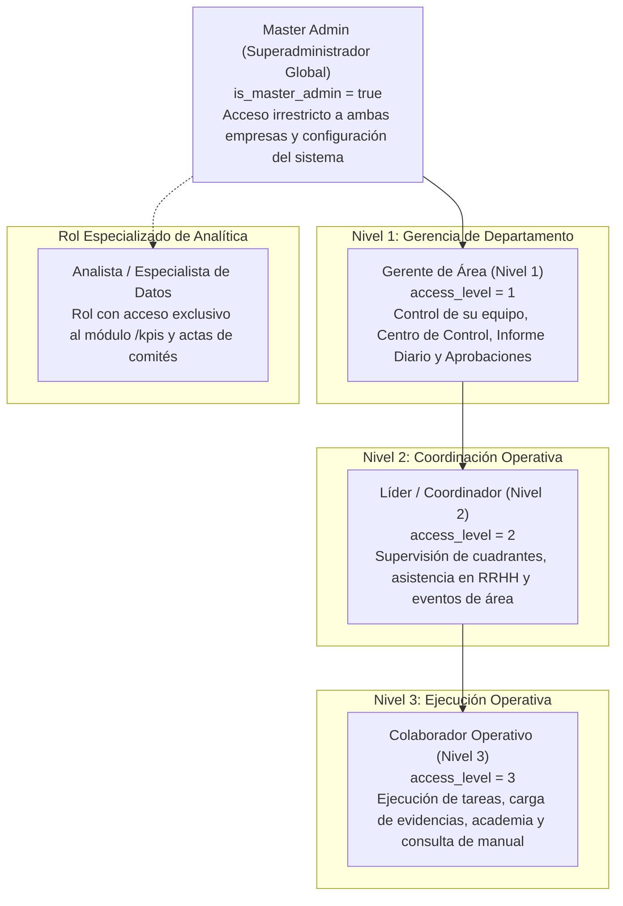
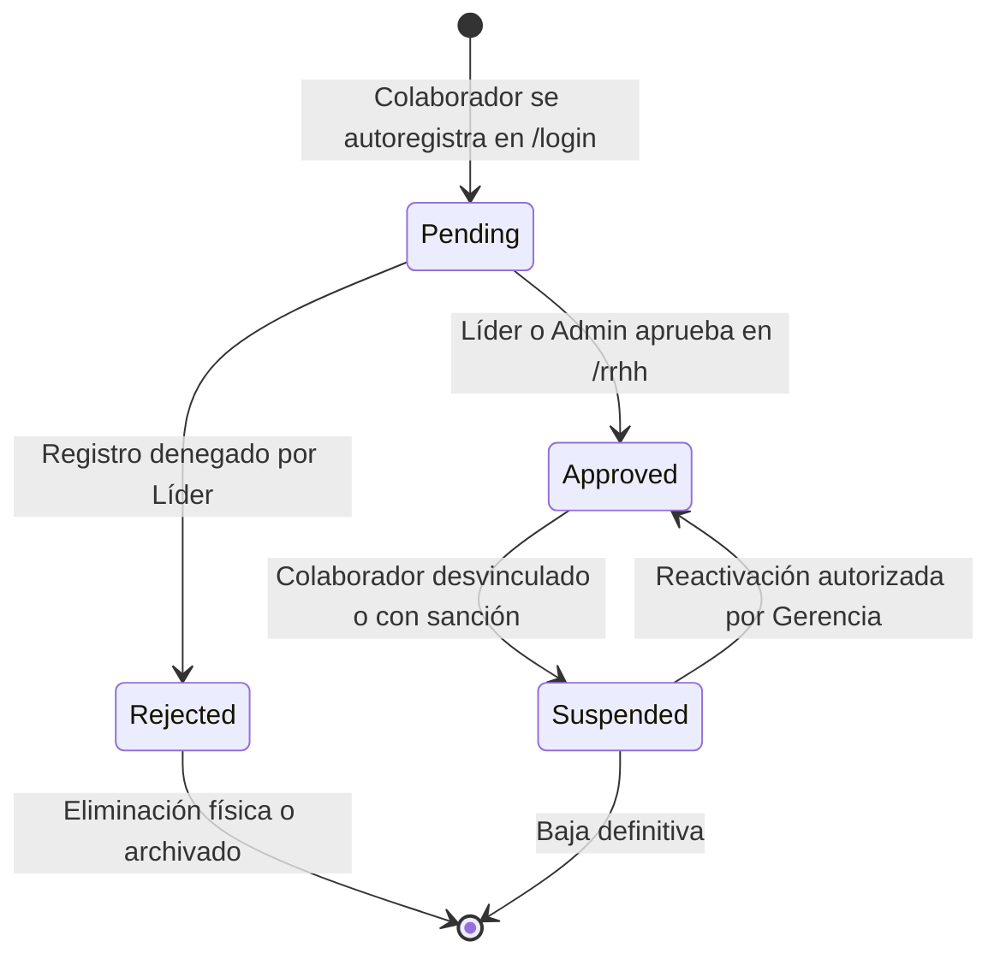

# Manual de Roles, Jerarquía y Matriz de Permisos

> **NOVA WORD — Access Control & Role Management Manual**  
> **Audiencia:** Gerencia General, Líderes de Área, Oficiales de Seguridad, Talento Humano y Auditoría  
> **Modelo de Control:** Role-Based Access Control (RBAC) + Row Level Security (RLS) en PostgreSQL

---

## 1. Jerarquía Organizacional y Niveles de Acceso

El sistema clasifica las identidades de usuario en una estructura piramidal de 3 niveles operativos estándar, más un perfil especial de analítica y el superadministrador global:

---

## 2. Descripción de Perfiles y Alcances Operativos

### 2.1 Master Admin (Superadministrador Global)
- **Criterio de Identificación:** `profiles.is_master_admin === true`.
- **Ámbito:** Global (Futupro y Elite Nutrition S.A.S.).
- **Atribuciones Exclusivas:**
  - Modificación de la topología organizacional en `/roles`: creación y supresión de áreas y cargos para toda la empresa.
  - Delegación y revocación de permisos para reseteo de contraseñas (`password_delegated_roles`).
  - Carga masiva y re-indexación de vectores semánticos en `/knowledge-loader`.
  - Visualización tridimensional de la red de procesos en `/mapa-procesos`.
  - Acceso a la consola avanzada del Oráculo de Inteligencia Artificial en `/oracle`.
  - Habilidad para asumir el contexto de cualquier área o rol para soporte técnico.

---

### 2.2 Gerente de Área (Nivel 1 de Acceso)
- **Criterio de Identificación:** `roles.access_level === 1`.
- **Ejemplos de Cargos Reales:** *Gerente de Contabilidad, Gerente de Operaciones, Gerente de Auditoría Pentágono, Gerente Comercial*.
- **Ámbito de Supervisión:** Estrictamente limitado a los colaboradores adscritos a su misma área organizacional y empresa.
- **Atribuciones Clave:**
  - Acceso irrestricto a `/leader` (Centro de Control Gerencial).
  - Creación de órdenes programadas y asignación de tareas ad-hoc a los miembros de su equipo.
  - Consulta y auditoría del **Informe Diario de Operaciones**, incluyendo revisión de fotografías de evidencia y justificaciones de incumplimiento.
  - Aprobación, activación y suspensión de cuentas de colaboradores subordinados en `/rrhh`.
  - Modificación de las plantillas de tareas recurrentes de los cargos de su departamento.

---

### 2.3 Líder / Coordinador de Equipo (Nivel 2 de Acceso)
- **Criterio de Identificación:** `roles.access_level === 2`.
- **Ejemplos de Cargos Reales:** *Coordinador de Bodega, Líder de Compras, Supervisor de Turno*.
- **Ámbito de Supervisión:** Miembros de su célula o turno operativo.
- **Atribuciones Clave:**
  - Acceso a `/mapa-cargos` para consultar la memoria de funciones de su equipo.
  - Apoyo en la gestión de colaboradores en `/rrhh` y consulta del calendario operativo en `/events`.
  - Cierre y ejecución de sus propias tareas rutinarias con evidencia obligatoria.

---

### 2.4 Colaborador Operativo (Nivel 3 de Acceso)
- **Criterio de Identificación:** `roles.access_level === 3`.
- **Ejemplos de Cargos Reales:** *Auxiliar de Bodega, Asistente Contable, Analista de Inventarios, Vendedor Junior*.
- **Ámbito:** Estrictamente individual.
- **Atribuciones Clave:**
  - Acceso pleno a su **Espacio de Trabajo** (`/workspace`).
  - Obligación de cierre de actividades mediante la ventana modal de evidencia (`EvidenceModal.vue`), aportando descripción y fotografía o justificación documentada.
  - Acceso a la Academia Corporativa (`/academia`) para revisión de videos y guías inductivas.
  - Consulta interactiva con el Agente Especialista de su Cargo para dudas normativas.

---

### 2.5 Rol Especial: Analista / Especialista de Datos
- **Criterio de Identificación:** Nombre de cargo que contiene el texto `'analista de datos'` o `'especialista de datos'`.
- **Atribuciones Clave:**
  - Es el **único rol operativo autorizado** para ingresar al módulo `/kpis` (Gestor de KPIs y Actas) junto al Master Admin.
  - Formulación y ajuste de fórmulas matemáticas para indicadores estratégicos.
  - Uso de la herramienta de IA de Claude 3.5 Sonnet para estructuración de KPIs.
  - Levantamiento y consolidación de actas de comités de gestión.

---

## 3. Matriz General de Permisos por Pantalla y Módulo

La siguiente tabla resume las facultades otorgadas por el sistema (donde **C** = Crear, **R** = Leer/Consultar, **U** = Actualizar/Editar, **D** = Eliminar/Desactivar, **A** = Aprobar):

| Módulo / Ruta | Colaborador (Nivel 3) | Líder (Nivel 2) | Gerente (Nivel 1) | Analista de Datos | Master Admin |
| :--- | :---: | :---: | :---: | :---: | :---: |
| **Inicio / Landing (`/`)** | R | R | R | R | R |
| **Espacio de Trabajo (`/workspace`)** | C, R, U (Propio) | C, R, U (Propio) | C, R, U (Propio) | C, R, U (Propio) | C, R, U, D |
| **Cierre de Tareas (Evidencias)** | C, U (Propio) | C, U (Propio) | C, U (Propio) | C, U (Propio) | C, U, D |
| **Centro de Control (`/leader`)** | 🚫 Sin acceso | 🚫 Sin acceso | C, R, U (Su Área) | 🚫 Sin acceso | C, R, U, D |
| **Informe Diario de Equipo** | 🚫 Sin acceso | 🚫 Sin acceso | R (Su Área) | 🚫 Sin acceso | R (Global) |
| **Organigrama (`/mapa-cargos`)** | 🚫 Sin acceso | R (Su Área) | R, U (Su Área) | R | C, R, U, D |
| **Gestión de Personal (`/rrhh`)** | 🚫 Sin acceso | R (Su Área) | C, R, U, A (Área) | 🚫 Sin acceso | C, R, U, D, A |
| **Gestor de KPIs (`/kpis`)** | 🚫 Sin acceso | 🚫 Sin acceso | 🚫 Sin acceso | C, R, U | C, R, U, D |
| **Estructura de Roles (`/roles`)** | 🚫 Sin acceso | 🚫 Sin acceso | 🚫 Sin acceso | 🚫 Sin acceso | C, R, U, D |
| **Delegar Contraseñas** | 🚫 Sin acceso | 🚫 Sin acceso | Si está delegado | 🚫 Sin acceso | C, R, U, D |
| **Academia (`/academia`)** | R | R | C, R, U | R | C, R, U, D |
| **Mapa de Procesos 3D (`/mapa-procesos`)** | 🚫 Sin acceso | 🚫 Sin acceso | 🚫 Sin acceso | 🚫 Sin acceso | R, U |
| **Oráculo e Inyección (`/oracle`)** | 🚫 Sin acceso | 🚫 Sin acceso | 🚫 Sin acceso | 🚫 Sin acceso | C, R, U |

---

## 4. Ciclo de Vida y Estados de una Cuenta de Usuario

1. **`pending` (Pendiente):** La cuenta no tiene acceso a ninguna función del sistema. Al autenticarse, el router redirige forzosamente a `/pending-approval`.
2. **`approved` (Aprobada):** Cuenta operativa activa con acceso pleno a los módulos autorizados según su `access_level`.
3. **`suspended` (Suspendida):** Acceso revocado en tiempo real; las sesiones activas son canceladas forzosamente mediante `supabase.auth.signOut()`.
4. **`rejected` (Rechazada):** Intento de registro descartado por no pertenecer a la compañía.

---

*Documento enlazado a [INDICE_MAESTRO.md](../INDICE_MAESTRO.md), [flujos_operativos.md](flujos_operativos.md) y [auditoria_y_seguridad.md](../flujos/auditoria_y_seguridad.md).*
